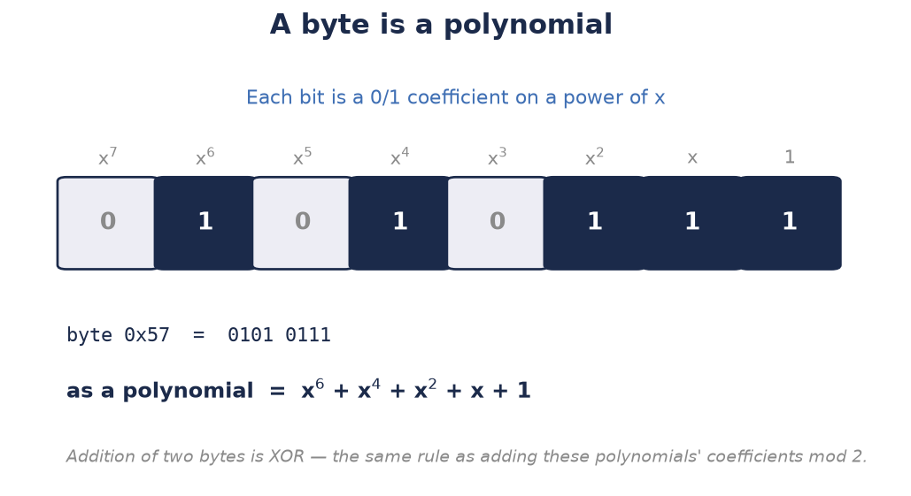
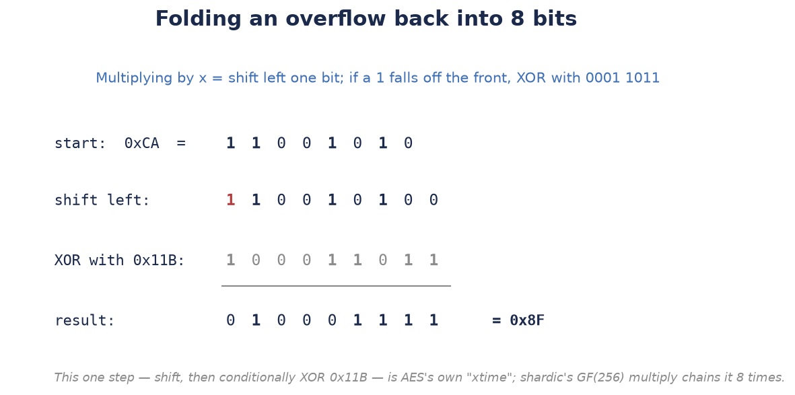
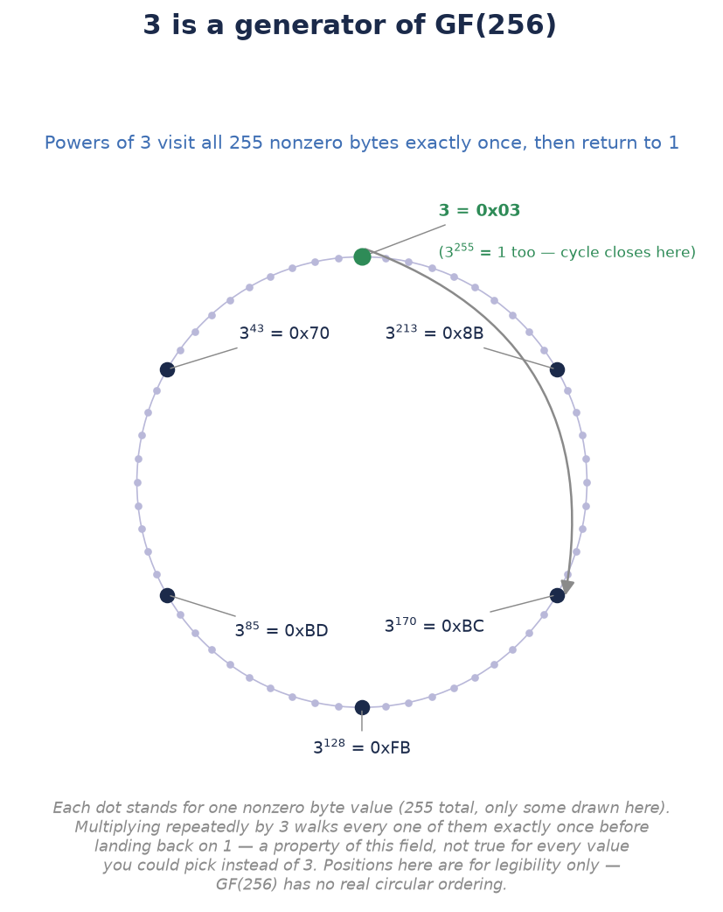

# Why GF(256) with Reduction Polynomial 0x11B and Generator 3

`docs/sss_explained_for_shardic.md` §5 explains *why* shardic's Shamir's
Secret Sharing (SSS) implementation works over GF(256) rather than real
numbers. This doc is the supplemental detail behind one specific phrase
used to describe that field in `gf256_sss.py`'s docstring and in the
whitepaper's §3.2: "the same field arithmetic AES itself uses (generator
3, reduction polynomial 0x11B)." It exists because that parenthetical
compresses two distinct pieces of finite-field math that are easy to
gloss over without unpacking them.

## 1. GF(256): the field itself

Both AES and shardic's SSS treat each byte as an element of GF(2⁸) — the
finite field with 256 elements. Addition in this field is ordinary XOR
(no carrying). Multiplication is harder: multiplying two bytes as
polynomials over GF(2) (coefficients are just bits) can produce a result
of degree ≥ 8 — too large to fit back into a byte. That overflow is
handled by reducing modulo a fixed polynomial, the same way modular
arithmetic reduces an integer product back into a fixed range.

{width="5.2in"}

The picture above is the whole trick for turning a byte into something
you can do algebra on: line the 8 bits up against descending powers of
x, and every `1` bit becomes a term in a polynomial. `0x57` isn't a
mysterious hex code here — it's just `x⁶ + x⁴ + x² + x + 1` written in a
more compact notation.

## 2. The reduction polynomial: 0x11B

`0x11B` in binary is `1 0001 1011`, which as a polynomial is:

```
x^8 + x^4 + x^3 + x + 1
```

Whenever a multiplication produces a degree-≥8 term, it's reduced modulo
this polynomial to fold the result back into 8 bits. This exact
polynomial is specified in the AES standard (FIPS 197) — not an
arbitrary pick. It's *irreducible* over GF(2) (it can't be factored),
which is precisely the property that guarantees every nonzero byte has a
multiplicative inverse under this construction — i.e., that GF(256) with
this reduction polynomial is actually a field, not just a ring. AES's
S-box is itself built from multiplicative inverses in this field.

{width="5.2in"}

Concretely, "multiply by x" is just "shift every bit one place left" —
and the picture above works a real example (`0xCA`) end to end. Shifting
`0xCA` left pushes a `1` out past the 8-bit boundary; that's the signal
to XOR the result with `0x11B`, which cancels that overflow bit back to
0 and folds the rest of the value into a proper byte, `0x8F`. Had the
leftmost bit been a `0` instead, no XOR would be needed at all — the
shift alone would already be a valid 8-bit result. This single
shift-then-conditionally-XOR step is exactly what AES's own reference
code calls `xtime`; multiplying two arbitrary bytes (as shardic's
`gf256_sss.py` does throughout its Shamir split/reconstruct math) is
built from repeating this same step once per bit.

## 3. The generator: 3

The 255 nonzero elements of GF(256) form a cyclic group under this
field's multiplication. A **generator** (primitive element) is a value
`g` such that `g¹, g², g³, ..., g²⁵⁵` cycles through every nonzero field
element exactly once before returning to 1. The byte value `3`
(polynomial `x + 1`) happens to be a generator for this specific
field/reduction-polynomial pairing — a property of this field, not
something the AES standard mandates you pick, but a well-known fact
about it that's exploited constantly in practice.

{width="3.6in"}

The diagram above is illustrative, not a literal number line — GF(256)
has no built-in ordering the way integers do, so the ring layout is
just for legibility. What it's showing is real, though: starting from
`3¹ = 0x03` and repeatedly multiplying by 3 visits a new nonzero byte
value every single time, and the 255th multiplication lands exactly
back on `1`. No shorter cycle is possible for a generator, by
definition — if it repeated early, it wouldn't have visited all 255
values.

Concretely, this is what makes fast software multiplication possible:
precompute a discrete-log table (`log₃`) and its inverse (the antilog /
exp table) once, then multiply two field elements via

```
a · b = 3 ^ (log₃(a) + log₃(b) mod 255)
```

— addition of logs instead of repeated polynomial multiply-and-reduce.
This is the standard technique used in AES reference implementations,
in `ssss` (Poettering's classic SSS tool, cited as precedent in the
whitepaper's §8.1), and in shardic's own `gf256_sss.py`.

## 4. Why this choice, specifically, for shardic

The point of naming both the reduction polynomial and the generator
explicitly — rather than just saying "GF(256)" — is a reuse and
credibility argument, not an aesthetic one: shardic doesn't invent its
own finite-field construction for splitting the DEK. It deliberately
reuses the exact same field, reduction polynomial, and generator
convention that AES itself is built on, and that decades of
cryptographic tooling (including `ssss`) already implement and have
been exercised against. That's materially lower-risk than a bespoke
field-arithmetic implementation would be — there is nothing novel in
shardic's byte-level math to get wrong, only well-trodden ground shared
with one of the most scrutinized ciphers in use.

## See also

- `docs/sss_explained_for_shardic.md` — the general SSS construction
  this field arithmetic supports (degree-(D−1) polynomials, Lagrange
  interpolation, why fewer than D points reveal nothing).
- `docs/shardic-cryptographic-path.md` — the code-grounded walkthrough
  of the full DEK → SSS split → shard protection → recovery path,
  including where this field arithmetic is actually invoked in
  `gf256_sss.py`.
- `gf256_sss.py` — the implementation itself; its self-tests
  (`python3 gf256_sss.py`) exercise this exact field construction.
