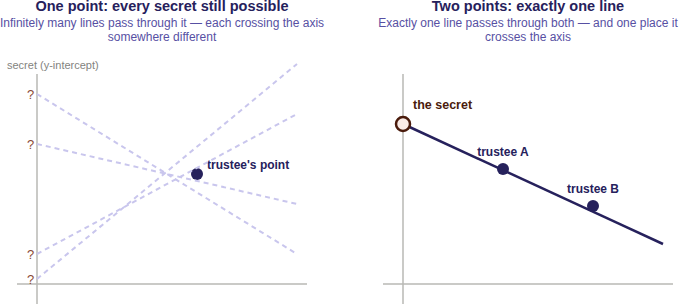
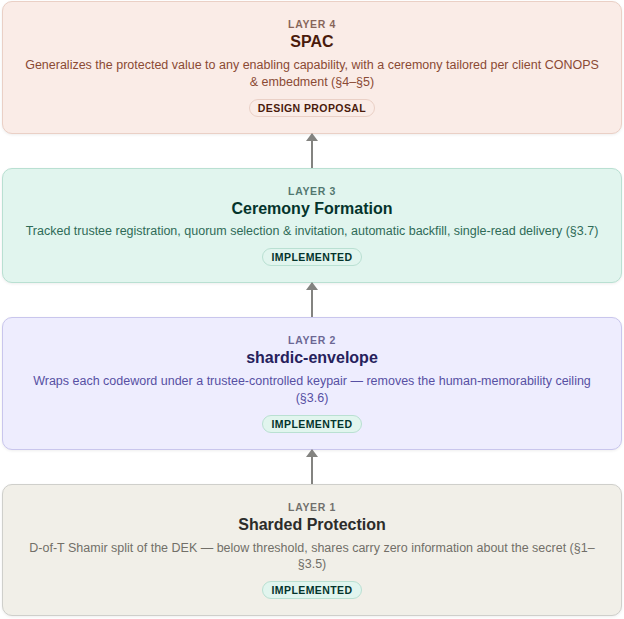
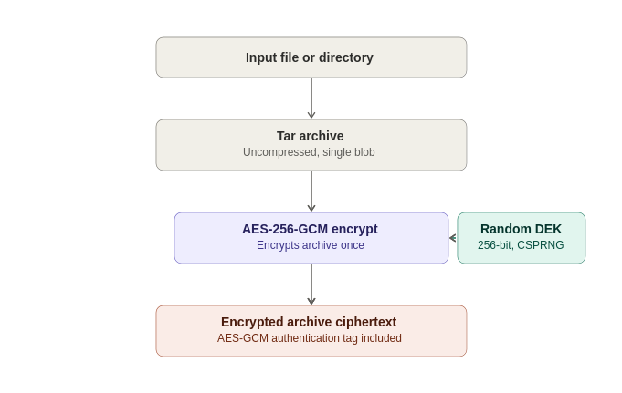
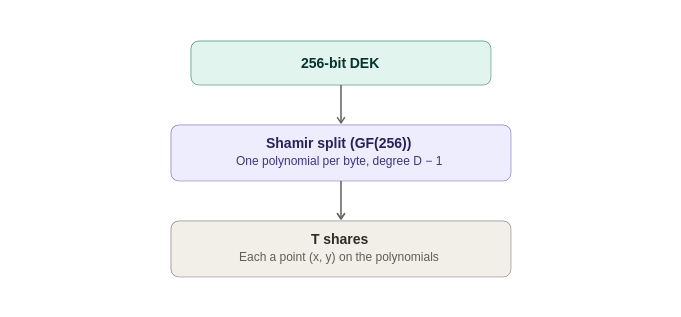
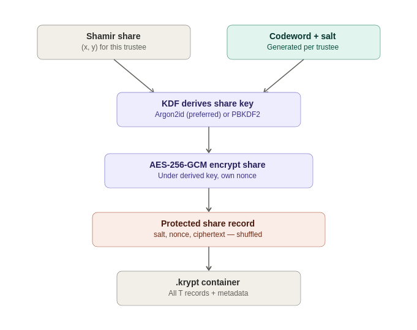
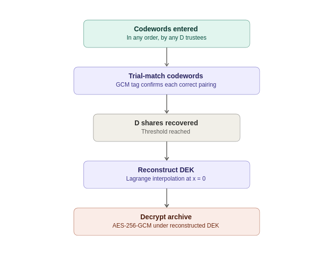
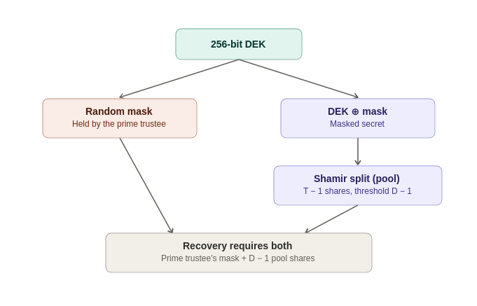
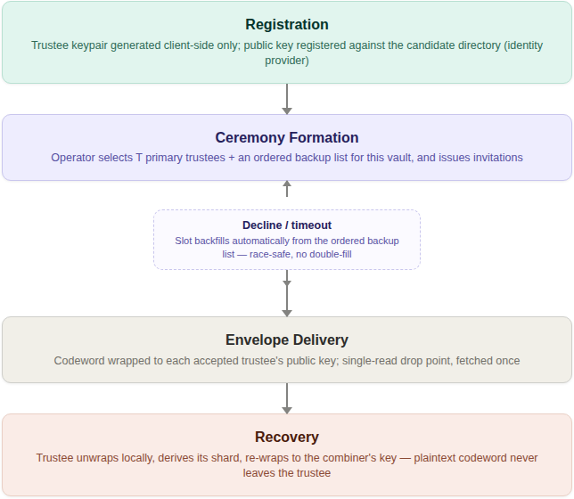
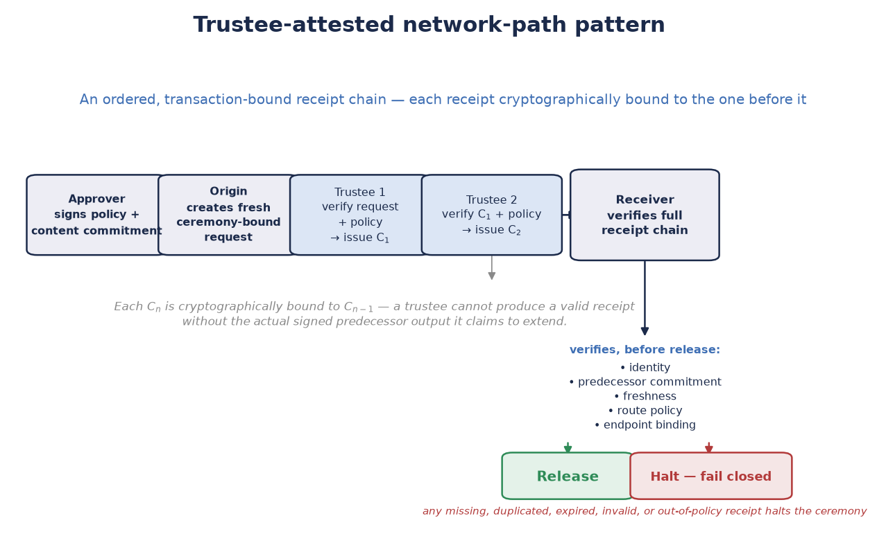
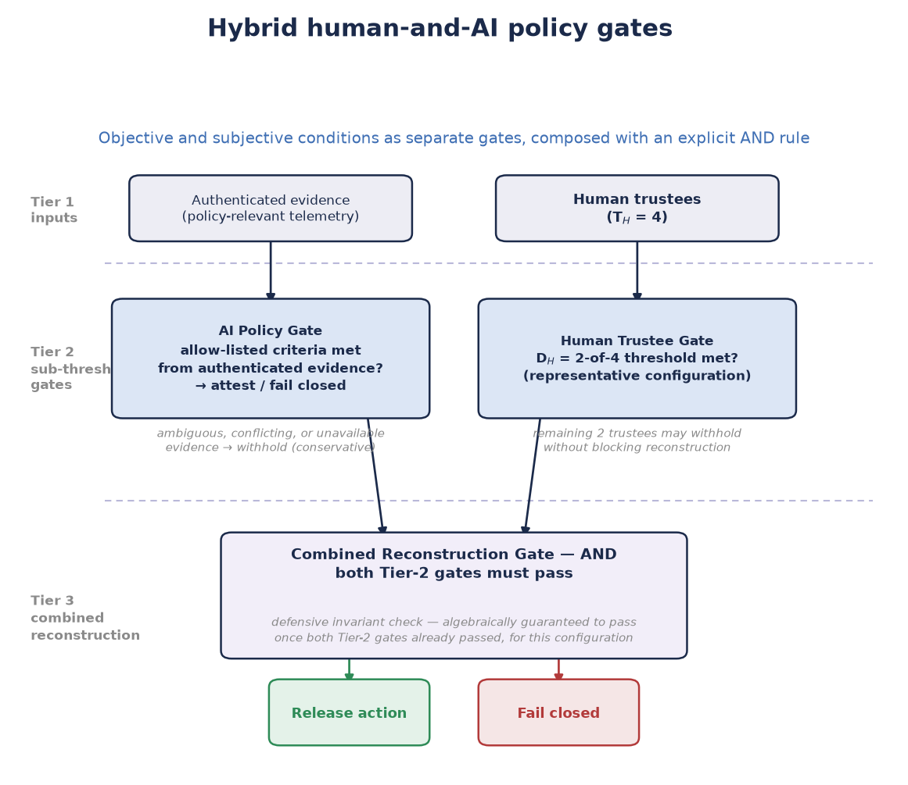

**SHARDIC**

Sharded Encryption for Threshold-Recoverable Vaults, System-Integration Ceremonies, and Product-Embedded Protected Actions

*One Threshold-Recovery Primitive at Three Levels of Implementation: Personal Utility, System Security Integration, and Product Protection*

**White Paper — Version 4.0**

September 2026

---

# Abstract

Conventional file encryption is monolithic: whoever holds the key, or controls the system that holds it, controls access to the plaintext — permanently and unilaterally. shardic removes that single point of control from the cryptography itself, rather than asking policy or process to compensate for it. A file or directory is encrypted once under a randomly generated data encryption key (DEK), and that DEK is split — using Shamir's Secret Sharing over GF(256) — into T shards distributed to T independent trustees, with a threshold D set below T. No fewer than D trustees, each unlocking their shard via an independently held **shardic encryption key**, can ever reconstruct the DEK; below that threshold, the remaining shards carry zero information about the key — a guarantee that holds regardless of computing power, not merely one that is expensive to break.

That single constructed cryptographic primitive is exemplified in three cumulative levels of implementation, each reusing the level below it unmodified. **Level 1 — personal and small-group utility** is the base scheme: a family, an individual, or a small organization protects a file with T human-held codewords and a threshold D, using the working command-line and GUI tools this project ships today, with no server and no network dependency at all. **Level 2 — shardic ceremony for system security integration** wraps that same primitive in public-key-wrapped key delivery and a repeatable, identity-backed registration, selection, and delivery process — a more complex and considerably more robust ceremony, suited to an organization's standing trustee pool rather than a one-off personal setup, and, like Level 1, implemented and running as a demonstration combiner service today. **Level 3 — SPAC for product protection** generalizes the protected value itself from "a file's plaintext" to any enabling code for a consequential action — arming a capability, releasing funds, authorizing a safety interlock — bound to a specific fielded product or system via a hardware-bound Fielded Prime Element. Level 3 is a design proposal built entirely on Level 1 and Level 2's already-implemented, unmodified math, not a new cryptographic construction. It is also where a specific, timely extension lives: composing human and AI trustee classes under one explicit threshold rule, so that neither an AI-initiated action nor a rogue or coerced human-initiated one can proceed without independent agreement from the other class.

§All three levels are summarized side by side, so a reader can find the depth of detail that actually matches their interest before committing to the full paper. The paper then explores Level 1's concept of operations and technical mechanics in full; next, it gives Level 2's ceremony mechanics; finally the paper walks through Level 3's SPAC ecosystem, including the Fielded Prime Element, shardware-token hardware variants, and non-bypassable invocation. We follow up with a security discussion spanning all three levels, closing with NEAT, a design framework this paper names for any critical SPAC deployment. Four illustrative scenarios walk through a full ceremony lifecycle — two grounded in Level 3's product-protection case, one extending the ceremony pattern to network-path integrity, and one dedicated to the hybrid human-AI policy-gate pattern. The, the discussion closes with a summary of what this design offers and where it deliberately doesn't fit. Appendix A gives the complete, standalone treatment of Shamir's Secret Sharing that §1.4 and §4.2 summarize inline; Appendix B gives the complete treatment of codeword-mode selection, tuning, and the field-deployment memorization case that §6.7 states only in summary.

---

## Terminology Key

Terminology. T is the number of shards; D is the reconstruction threshold. A PT SPAC is the plaintext enabling value for a protected action; a CT SPAC is its protected ciphertext form. A Fielded Prime Element is a deployment-specific hardware-bound contribution intended to bind release to an approved fielded system.

# 1. The Need for Threshold-Recoverable Protection

## 1.1 Conventional Data Encryption: Monolithic, Single-Point Control

The standard model of symmetric encryption is simple: a key is generated, data is encrypted under it, and the key is stored or shared so that plaintext can later be recovered from the ciphertext. That simplicity is also the model’s structural weakness. Whoever possesses the key — a person, a process, a single server — has complete and unilateral power over the data it protects. Access is a binary, anonymous fact: either you hold the key, or you don’t. There is no way, within the cryptography itself, to require that access be a joint decision, or to prove after the fact who authorized a given recovery.

This single-point-of-control property persists even when the key management around it becomes more sophisticated. Wrapping a symmetric key with a public key so it can only be unwrapped by whoever holds the matching private key changes who the single point of control is, but not that there is one — the private key becomes the new monolithic secret. Locking a key inside an HSM, a safe, or a physically secured server changes where the single point of control lives, but a single compromised operator, a single coerced administrator, or a single stolen credential is still sufficient to defeat it. None of these supplements change the underlying shape of the trust model: one secret, one holder, one point of failure.

For routine data protection this is an acceptable, even desirable, trade-off — simplicity and low friction usually outweigh the risk. It becomes a liability precisely in the cases organizations care about most: root credentials, master keys, and archives whose disclosure or misuse by a single rogue, insider threat, or compromised party would be catastrophic.

## 1.2 Sharded Encryption: Enforcing Multi-Person Integrity

Shardic: sharded threshold-recoverable encryption addresses this by removing the single point of control from the cryptography itself, rather than relying on policy or process to compensate for it. Instead of one key held by one party, the data encryption key (DEK) is embedded as a value on a randomly generated polynomial, constructed via Shamir's Secret Sharing so that a threshold of D points is required to reconstruct it. T points on that polynomial — the shards — are each entrusted to one of T independent trustees, unlocked only via that trustee's own shardic encryption key. No shard is a fragment or segment of the DEK itself; recovering the plaintext requires at least D trustees to each independently choose to unlock their shard and contribute it to the reconstruction. Critically, this is not merely operationally enforced (e.g., by requiring D signatures at an application layer) — it is information-theoretically enforced: any collection of fewer than D shards leaves the underlying polynomial, and therefore the DEK, completely undetermined — consistent with every possible DEK value equally, no matter how much computing power is applied against it.

The practical effect is that:

- No single trustee — including whoever originally created the protected content (the "vault") — can ever recover the data alone.

Operational assumption: this guarantee applies only after the creator has securely deleted plaintext, retained shards, codeword copies, and other recovery material, and after trustee distribution has been verified. The cryptography cannot undo copies retained outside the scheme.

- A rogue insider, a coerced employee, or a single compromised account is insufficient to cause disclosure; a collusion of at least D independent parties is required.

- The trustee pool can absorb the loss or unavailability of up to T − D trustees without losing recoverability — unlike a strict N-of-N or two-person rule, which has no slack.

A recovery can produce an auditable record of authenticated contributors when the deployment uses protected signing credentials, signed contributions, trustworthy timestamps, and retained verifiable logs. Threshold reconstruction alone does not establish identity or legal non-repudiation.


This shifts data protection from "who holds the key" — a fact about custody — to "who agreed to unlock it" — a fact about consent, distributed across independent parties who cannot individually override the group.

## 1.3 Representative Use Cases

Threshold-recoverable encryption is the right tool wherever policy, regulation, or risk tolerance already implies that no single party or entity should be able to unilaterally decrypt something, and where access is rare and high-stakes rather than continuous and routine. Representative examples include:

### Break-glass access to critical infrastructure

A root certificate-authority private key, a production database master key, or a SCADA override credential is locked in a vault with, say, T=7 trustees — a mix of senior engineers, security officers, and an executive — and a D=4 threshold. Day to day, nobody has access to the key at all. It is reconstructed only for a genuine emergency, and only if four of the seven trustees each independently agree to participate.

### Diceware-style estate and succession planning

A family or founder splits access to a password manager's master vault, or other key-person credentials, among relatives, a lawyer, and a business partner (T=5, D=3), using memorable, whole-word codewords that trustees can actually commit to memory rather than write down.

### Government and public-sector applications

- Generalized two-person-rule systems ("any 3 of 7 officials") that tolerate absence or incapacitation without weakening the no-lone-actor requirement of the classic two-key model.

- Escrowed decryption keys for classified or lawful-intercept archives, split across officials from different branches or agencies so that no single agency — or a rogue insider within one — can unilaterally decrypt.

- Continuity-of-government credentials that must survive the loss of some custodians while still requiring majority agreement to invoke.

- Election-system tabulation keys split among representatives of multiple parties or observers.


### Business and regulated-industry applications

- M&A escrow and dispute-resolution vaults — deal terms or sensitive documents released only by quorum of board members, outside counsel, and an escrow agent.

- Cryptocurrency or treasury cold storage — splitting root key material behind a multisig wallet among founders or board members so no single executive can move funds alone.

- Whistleblower or source-protection archives, releasable only if a threshold of editors or lawyers agree.

- Regulated data with explicit separation-of-duties requirements (e.g. SOX, HIPAA "minimum necessary" contexts) — a technical enforcement of an existing compliance control rather than a policy statement alone.


This approach fits best for rare, high-stakes, offline "break-glass" access with a small, semi-static trustee set, where the vault file itself must be safely storable and shareable without leaking metadata about who holds what. It is a poor fit for frequent or live authorization, especially for revoking a single trustee without a full re-split, or for online multi-party protocols better served by other threshold-signature schemes (e.g. FROST) or HSM-backed multisig, which support key rotation and live quorum.

## 1.4 How Threshold Secret Sharing Works, Conceptually

The byte-by-byte construction is presented later, but it's worth building the intuition for why a threshold scheme works at all — because the "splitting a key into pieces" is not what shardic does, and doesn't have the security properties shardic promises.

Cutting the 32-byte DEK into four 8-byte chunks and handing one chunk to each of four trustees — or the slightly cleverer version, XOR-splitting, where each shard is random and the last one is defined so that all of them XOR back to the key also creates multi-entity protection. Both can be made information-theoretically sound in the narrow sense that holding fewer than all the pieces reveals nothing. But both share the same structural flaw: they are all-or-nothing schemes. Reconstruction needs every single piece, with no way to ask for "any D of T." Lose one trustee, permanently, and the key is gone forever — a weakness threshold recovery exists to avoid. 

The actual idea: hide the secret as a point only enough hints can locate. Picture the DEK not as a string of bytes but as a single point on a graph — specifically, where a straight line crosses the vertical axis. Draw that line so it also happens to pass through T other points, one assigned to each trustee. Handing a trustee "their" point tells them nothing on its own: infinitely many different lines pass through any single point, each crossing the axis somewhere completely different, so every possible secret remains equally possible. But hand over any two trustees' points together, and there is exactly one straight line that passes through both of them — which means there is exactly one place it crosses the axis. Two points determine a line; that's what makes D = 2 work.

{width="5.2in" height="2.33in"}

Raise the threshold to three, and the trick generalizes: instead of a straight line, use a curve with one more bend (a parabola), which takes three points to pin down uniquely rather than two. One or two points still leave every possible secret equally plausible — the curve simply isn't determined yet. This is the general pattern: a threshold of D is implemented as a curve that requires exactly D points to fix, with T points handed out, one per trustee, all lying on that same curve. Because the curve only needs any D of its T points — not a particular D, and not all T — the scheme absorbs losing up to T − D trustees exactly as described in §1.2.

Partial progress isn't a thing here. A combination lock rewards partial knowledge — get two of three digits right and you are, in a real sense, close. A threshold secret scheme doesn't work that way. One trustee's point, or even D − 1 of them together, doesn't narrow the secret down to a short list of likely candidates; it leaves every possible value exactly as plausible as before. There's no partial credit, no "getting warmer," and no way to make attempts and rule out candidates one collusion at a time — until the Dth point the answer doesn't exist.

shardic's actual implementation replaces "a line" or "a curve on a graph" with a polynomial of degree D − 1 evaluated over a finite field, applied independently to each byte of the DEK — the same idea above, precise and computable. §4.2 provides a deeper tech explanation.


# 2. Three Levels of Implementation

Sections 3–6 describe shardic's mechanics in full; this section previews how those mechanics stack into three cumulative levels, so a reader can find the depth of detail that actually matches their interest before diving into the rest of the paper. Each level reuses the D-of-T guarantee established at Level 1 without modification — Level 2 changes how a trustee's key reaches them and how a trustee pool is organized; Level 3 changes what the protected value actually gates. A deployment can stop at any level and still have a complete, sound system — each level is independently useful on its own terms, not a prerequisite staging ground for the next.

{width="5.2in" height="5.16in"}

## 2.1 Level 1 — Personal and Small-Group Utility (implemented)

The foundational capability, and the only one required for the personal, estate, and small-business scenarios in §1.3: split a secret so that no fewer than D of T independently held codewords can ever reconstruct it, with zero information about the secret below that threshold no matter how much computing power is thrown at it. This is a complete, standalone tool today — the project's CLI and GUI frontends implement exactly this, with no server, no network dependency, and no infrastructure beyond the `.krypt` file itself and whatever out-of-band channel an operator uses to hand codewords to trustees. §3 walks through creating and recovering a vault at this level; §4 gives the underlying technical mechanics.

## 2.2 Level 2 — Shardic Ceremony for System Security Integration (implemented)

Level 1's manual, one-off codeword handoff is the right fit for a family or a small team, but it doesn't scale to an organization that needs a standing, auditable, repeatable process — a security team managing many vaults against a rotating on-call trustee pool, for instance. Level 2 is that more complex and considerably more robust ceremony: shardic-envelope removes the human-memorability ceiling by delivering each trustee's key public-key-wrapped rather than memorized, and ceremony formation turns trustee registration and selection into a tracked process against an identity provider — candidate registration, per-vault quorum selection with an ordered backup list, automatic backfill on decline or timeout, and single-read, addressed delivery of each wrapped key. This is implemented and demonstrated end-to-end today (`shardic_envelope_crypto.py`, `demo/combiner/app.py`), not merely proposed. §5 gives the full mechanics; adopting it is optional — a deployment that only needs Level 1 loses nothing by skipping it.

## 2.3 Level 3 — SPAC for Product Protection (design proposal)

Level 3 generalizes the protected value itself from "a file's plaintext" to any enabling code for a protected action — a shardic protected action code, or SPAC — and generalizes the ceremony from one fixed shape into something tailorable per deployment: which trustees, which local-unlock factors, which recovery-time objective, to fit the CONOPS and embedment environment of a specific product or fielded system. Binding a SPAC to one specific piece of hardware (the Fielded Prime Element, §6.2) is what turns this from an abstract capability-gating framework into something a product team can actually embed: a treasury platform's disbursement-signing credential, a safety interlock's release-enable value, or any other consequential action a product should never be able to authorize on the strength of a single compromised or coerced party. This level also includes the pattern this project treats as most consequential: composing human and AI trustee classes under one explicit threshold rule, so that neither an AI-initiated action nor a rogue human-initiated one can proceed without independent agreement from the other class (§8.4–§8.5). Everything in this level is a design proposal, built entirely on Level 1 and Level 2's already-implemented and unmodified math — §6 gives the full treatment.


# 3. Level 1: Concept of Operations

## 3.0 Scope of This Section: Mechanical Foundation, Not End Solution

This section describes shardic's mechanical foundation at the operator's level  — how a protected value gets created, distributed, and reconstructed — independent of any particular tool. It's an essential component of a protection system, but not an end solution: a deployment must separately establish its authorization policy, trusted operating environment, identity and credential assurance, custody procedures, audit retention, incident response, and system-specific safety controls before a protected value or SPAC is used operationally.

## 3.1 Creating a Vault

An operator with a file or directory to protect decides on two numbers before doing anything else: how many trustees (T) will each hold a shardic encryption key, and how many of them (D) must agree to recover the data. Given those numbers, vault creation is a fixed sequence: the input is archived into a single blob and encrypted once under a randomly generated 256-bit data encryption key (DEK); that DEK is split into T Shamir shards at threshold D; each shard is individually protected under its own shardic encryption key (SEK) (§4.3); and the result is written as one self-contained `.krypt` file, plus one credential per trustee — whatever form that credential takes for the derivation source chosen (§4.3).

The SEK wrapping mechanism can be adapted to the end solution. For the initial protype utility a set of code-words were generated and a key derivation function used to create the key. A PKI protected DRBG key can also be used for established environments with identity and access management systems in place. In short, shardic can integrate irrespective of key generation and protection mechanisms.

The operator's remaining job at this point is entirely procedural, not cryptographic: distribute each trustee's shard recovery credential to exactly one trustee, out of band, over a channel that defined system or trustee individually controls, then delete any local copies. Who receives which credential, and how, is a trust decision that belongs to the operator, not the software — the tooling deliberately does not automate distribution.

## 3.2 Recovering a Vault

At recovery time, any D of the T trustees supply their shardic encryption key — the operator does not need to know or specify which D. Recovery does not ask "which trustee are you": it tries each supplied key, via its derived AES-GCM key, against every not-yet-matched shard until one authenticates (§4.4). Keys can be supplied in any order, and if fewer than D of them match, or any of them are wrong, recovery reports how many were accepted and stops — it never produces partial or best-guess output.

## 3.3 shardic-prime: A Mandatory-Trustee Variant

The base scheme treats every trustee identically — any D of T shardic encryption keys recover the vault, full stop. shardic-prime is a separate variant that adds one essential trustee on top of the base scheme: the prime trustee's key must always be among those supplied, no matter how many other keys are gathered. The remaining trustees form an ordinary interchangeable pool for the rest of the threshold. This fits situations where one specific role — an estate's executor, an organization's security lead — must always sign off, while the people backing them up can be any qualifying subset. In T=4, D=3 prime-trustee terms, that means one prime trustee plus three pool trustees, and recovery needs the prime's key plus any two of the three pool keys.

All three pool keys, gathered without the prime trustee's, recover nothing — a cryptographic property guaranteed by the construction itself (§4.5), not merely enforced by the tooling. As with the base scheme, recovery does not require the operator to say in advance which supplied key belongs to the prime trustee; it is identified automatically once decryption succeeds. §6 revisits the prime trustee's role directly — it turns out to generalize to a hardware-embodied instance without requiring any new mathematics at all.


# 4. Level 1: Technical Mechanics

Here's how the .krypt container actually protects data: how the data encryption key is generated, how Shamir's Secret Sharing protects its recovery, how each individual shard is, in turn, protected by a shardic encryption key, and how the scheme has since extended into public-key-wrapped delivery and multi-party ceremony formation.

## 4.1 Archive and Data Encryption Key

Vault creation proceeds in a fixed sequence:

- The input file or directory is bundled with tar into a single blob, so any input shape — one file or an entire directory tree — is handled uniformly. The archive is deliberately left uncompressed (mode "w", not "w:gz") so ciphertext size does not vary with plaintext compressibility any more than strictly necessary — compression can otherwise leak information about content through size alone.

- A random 256-bit data encryption key (DEK) is generated using a cryptographically secure random source (secrets.token_bytes).

- The archive is encrypted exactly once, under that DEK, using AES-256-GCM with a randomly generated 96-bit nonce. GCM provides both confidentiality and built-in tamper detection: any modification to the ciphertext causes authentication to fail rather than silently decrypting to garbage.


At this point, the DEK is the single piece of secret material standing between the ciphertext and the plaintext — exactly as in conventional symmetric encryption. What differs from the conventional model is what happens to that key next.

{width="5.2in" height="3.29in"}

## 4.2 Shamir's Secret Sharing over GF(256)

Rather than being stored or handed to a single custodian, the DEK is split using a byte-wise implementation of Shamir's Secret Sharing (SSS) over the finite field GF(2⁸) — the same construction used by classic tools such as ssss, and the same field arithmetic AES itself uses (generator 3, reduction polynomial 0x11B).

The construction, applied independently to each of the DEK's 32 bytes:

- Each byte of the secret becomes the constant term of a random polynomial of degree D − 1, with the remaining coefficients drawn uniformly at random.

- Each of the T shards is that polynomial evaluated at a distinct x-coordinate (1 through T), across all 32 byte positions simultaneously.

- Reconstruction takes any D shards and applies Lagrange interpolation at x = 0, independently per byte position, to recover the original secret byte.


Technically, this is described as "information-theoretic", not merely computational. A polynomial of degree D − 1 is uniquely determined by any D points on it — but with only D − 1 points, every possible value of the constant term (the secret byte) remains equally consistent with those points. An attacker holding D − 1 shards therefore learns exactly zero bits about the DEK, regardless of computing power, time, or future cryptanalytic advances against AES itself. This is a critical distinction in the evolving world of *cryptographically-relevant quantum computers* -- "Information-theoretic" security means a guarantee that holds regardless of computing power — not because breaking it is hard, but because the information needed to break it simply isn't there.

{width="5.2in" height="2.42in"}

## 4.3 Shardic Encryption Key Protection of Shards

A raw Shamir shard is still just data — if written to disk unprotected, whoever possesses D of them could reconstruct the DEK without any trustee's cooperation at all. Each shard is therefore itself individually encrypted before being placed in the vault, under a 256-bit AES-256-GCM key held by that shard's trustee: the **shardic encryption key**. What matters for the design's guarantee is only that each trustee holds one, independently — not how any given trustee's key came to exist. Four derivation sources are named here as the pluggable mechanism this protects against a single implementation choice going stale; a deployment picks whichever fits its trustee population and CONOPS, and can mix sources across trustees in the same vault:

- **KDF from a memorized or transcribed secret** — the scheme implemented and demonstrated today. A random, human-typeable secret (a **codeword**, in this project's own terminology — see Appendix B for its three generation modes) is generated for the shard, a random salt is generated, and a 256-bit key is derived from the two using PBKDF2-HMAC-SHA256 (400,000 iterations by default) or Argon2id (time_cost=4, memory_cost=256 MiB, parallelism=4 — memory-hard, and preferred when the optional argon2-cffi package is available). This is the only source of the four that asks a trustee to recall or transcribe anything; §7.1 discusses why its strength, not the Shamir/AES layer, is the design's real computational bottleneck.

- **shardic envelope** — a full-strength key drawn from a CSPRNG, with no wordlist step and no KDF stretching, delivered to the trustee public-key-wrapped rather than memorized. §5.1 describes the delivery mechanism; §6.7 states the SPAC-specific default and its rationale; Appendix B gives the fuller treatment of when the codeword alternative is preferable.

- **External token** — the key is sourced from, or released only by, a hardware credential the trustee already holds (a PIV/FIDO2 device, an HSM, a shardware-token per §6.3), rather than generated by this project's own code at all. Useful wherever a trustee population already operates as cryptographic identities with standing tooling, and the deployment would rather reuse that infrastructure than stand up a parallel one.

- **Other mainstream key-generation or derivation mechanisms** — an explicit extensibility point, not a fixed list. Shard protection only ever needs a 256-bit AES-GCM key from somewhere; an enterprise KMS-issued key, a PKI-issued credential, or any other standards-based mechanism a deployment already trusts is as valid a source as the three named above, provided the resulting key is generated and held with comparable rigor.

The shard (its x-coordinate plus its 32 y-bytes) is encrypted with AES-256-GCM under the resulting key, using its own random nonce. The vault records, per shard, only an opaque triple: {salt, nonce, ciphertext} for a KDF-sourced key, or {nonce, ciphertext} for a key that skips the KDF step entirely (§6.7). Which derivation source, KDF method, and parameters were used are recorded once in the container's metadata — self-describing, so recovery never needs to be told out-of-band which settings a given vault used.

{width="5.2in" height="4.11in"}

## 4.4 The .krypt Container and Zero-Leakage Indexing

All of the above — metadata and ciphertext — is bundled into a single .krypt file: an 8-byte magic header, a length-prefixed JSON metadata block, and the raw AES-GCM ciphertext of the archive (stored as raw bytes, not base64-encoded, avoiding a ~33% size penalty). This is deliberate: there is exactly one file to copy, email, or upload, with nothing to accidentally separate from a companion metadata file.

The metadata's list of protected shards carries no mapping from record to trustee, and no mapping from record to shardic encryption key — each entry is simply an opaque {salt, nonce, ciphertext} triple, and the order of entries in the file is randomly shuffled at creation time. Recovery works by trial matching: each key the operator supplies is tried, via AES-GCM, against every not-yet-matched shard record in the vault. GCM's authentication tag makes this a reliable oracle — the correct pairing decrypts successfully, and every incorrect pairing fails fast with an authentication error rather than producing plausible-looking garbage.

The practical use cases for shardic, realistically, are limited to double-digit numbers of trustees. With T in the tens, this exhaustive trial is effectively instantaneous, and it has a meaningful security consequence: the .krypt file, examined on its own, reveals nothing about which shard belongs to which trustee, or how many keys would need to be compromised together to threaten a specific subset of the data. (Note: the underlying construction generalizes to a larger
  field without new cryptographic risk, though it isn't a drop-in change).

{width="5.2in" height="4.00in"}

## 4.5 How shardic-prime Varies

shardic-prime layers a one-time-pad mask over the ordinary Shamir construction described above, rather than introducing new field arithmetic. Given the DEK as the secret:

```
mask          = random bytes, same length as the DEK
masked_secret = DEK XOR mask
pool_shards   = split_secret(masked_secret, pool_threshold, pool_size)
```

The prime trustee's shardic encryption key protects mask directly — an all-or-nothing pad, not a point on a Shamir polynomial. Recovery requires both mask and at least pool_threshold pool shards:

```
masked_secret = reconstruct_secret(pool_shards)
DEK           = masked_secret XOR mask
```

Without the mask, the pool shards — even all of them — reconstruct only masked_secret, which is uniformly random and indistinguishable from noise without the mask to remove. Without at least pool_threshold pool shards, mask alone reveals nothing either. Both halves of the construction retain the same information-theoretic guarantee as the base scheme; layering them is what makes the prime trustee mathematically essential rather than merely conventionally required.

{width="5.2in" height="3.33in"}

This one-time-pad construction turns out to be the critical piece of everything in §6: because mask is just a value, nothing about reconstruct_secret_with_prime() requires that value to be held by a human. §6.2 reuses this exact code, unmodified, to bind the same mathematics to a piece of hardware instead to broaden the potential toolbox.


# 5. Level 2: Shardic Ceremony for System Security Integration

§2.2 introduced this level: the same primitive as §3–§4, wrapped in public-key-wrapped key delivery and a repeatable, identity-backed registration and selection process, for a deployment whose trustee pool is a standing organizational asset rather than a one-off personal arrangement.

## 5.1 shardic-envelope: Public-Key-Wrapped Delivery (Implemented)

Using a KDF-from-a-memorized-secret source that asks a trustee to recall or transcribe something provides a quick and low-friction mechanism for ersatz key distribution, but the upshot is that this results in this individual key's strength, not the Shamir/AES layer, is the design's real computational floor for that source. shardic-envelope removes that shortcoming entirely for systems & trustees willing to hold a cryptographic keypair, by wrapping each trustee's shardic encryption key in public-key encryption under a key they already control — rather than under a memory limit. As of this writing, shardic-envelope is implemented and demonstrated end-to-end (shardic_envelope_crypto.py, demo/combiner/app.py), not merely proposed.

- Operates strictly on the output of vault creation — the plaintext credential a trustee would otherwise have received — rather than modifying vault_core.py itself, so the existing encrypt/split/KDF path is untouched and the base scheme's guarantees are unaffected.

- Wraps each trustee's key in a hybrid, ECIES-style envelope (X25519 ECDH + HKDF-SHA256 + AES-256-GCM), deliberately shaped to mirror the vault's existing {salt, nonce, ciphertext} shard-record convention rather than inventing a new format.

- The combiner — the service that holds .krypt ciphertext and every wrapped envelope, and orchestrates registration and recovery — never receives a plaintext shardic encryption key at any point, only shards derived locally by each trustee and re-wrapped for the combiner's own public key on the way back.


Recovery is unchanged from a trustee's point of view in the base scheme: they still supply a plaintext key or its derived shard. What changes is provisioning — the trustee's own device decrypts an envelope locally, once, to obtain the value they would otherwise have had to memorize, transcribe, or otherwise handle themselves.

## 5.2 Ceremony Formation, Credentials, and Delivery (Implemented)

§5.1 brought up two functional needs that a follow-on design prototype to define the shardic "ceremony" --essentially a lifecycle process, answered: 

1. How does a trustee's public key get established and trusted in the first place, and 
2. How does an operator convene a specific quorum of trustees for a given vault rather than improvising trust decisions ad hoc each time?

- Registration. Candidate trustees are drawn from a dedicated Keycloak group, queried via a read-only service account scoped to that group. Each trustee's keypair is generated client-side only — the private key never transits, or is even briefly held by, any server shardic controls. This deliberately keeps identity/selection (Keycloak's job) cleanly separated from key custody (never Keycloak's job).

- Ceremony formation. An operator (authenticated via a dedicated shardic-operator realm role) selects T primary trustees plus an ordered backup list from the registered candidate pool, and issues invitations. Declined or timed-out invitations backfill automatically from the ordered backup list — race-safe, so a late acceptance from an already-backfilled slot is rejected rather than silently double-filling it. An explicit separation-of-duties check blocks the operator who forms a ceremony from also self-selecting as one of its trustees.

- Delivery. Wrapped envelopes are deposited at an authenticated, single-read drop point, addressed by trustee identity rather than a contact channel. The trustee fetches their own envelope themselves, once. "Exactly once" redemption functions as a detection mechanism — a second read attempt on an already-claimed envelope is a signal something is wrong.

- Recover. Unaffected. §3.2's walkthrough describes the same underlying act either way.


{width="5.2in" height="4.52in"}

The organizing principle across all of this: identity and selection stay cleanly separated from key custody, and both stay separated from the offline, fail-closed recovery math described in §4.1–§4.4. A compromised identity provider or a stalled ceremony can block provisioning; neither can, on its own, weaken the D-of-T guarantee itself. §6 builds directly on top of this ceremony-formation machinery — it is reused unmodified for the pool-trustee side of a SPAC ceremony.


# 6. Level 3: SPAC for Product Protection

Status: design proposal.

We've established a functional baseline for multi-entity enforced access. What follows is a technologically sound manifestation of that capability into a practical working system. Though not yet fielded, there are no barriers intrinsic to the cryptography itself. 

The generalized approach matters maps well where the stakes are increasingly harder to keep genuinely under human control: high-value operations increasingly initiated, analyzed, or partly executed by AI systems, under time pressure that erodes purely procedural safeguards. There's a lot more beyond clever math needed to underpin the infrastructure needed for human-in-the loop AI protections (discussed in §7.5), and §8.4 has deeper discussion for that case directly once the mechanics below are in place. In the meantime more background on SPAC is relevant:


## 6.1 From Data to Capability: PT SPAC and CT SPAC

§2.3 introduced this as Level 3's generalization beyond file decryption — the plaintext shardic protects has never had to be a file — it is, more generally, the enabling value for some protected action: gaining financial access, arming a safety-critical system, unlocking a sensitive document, or granting account access, wherever "the right D-of-T parties agreed" should be the actual gate on the action, not just a procedural approval layered on top of it. A shardic protected action code (SPAC) is that enabling value; PT SPAC and CT SPAC define its plaintext and ciphertext forms, in exactly the same relationship as any other plaintext/ciphertext pair in this project. In this context shardic's recovery portion of its defined ceremony releases the plaintext protected action data or logic into the operational run-time environment--whether code or programmable logic.

This reframe has precedent outside cryptography. Permissive Action Links (PAL) — a code required to authorize a safety-critical action, withheld until an authorized multi-party release procedure completes — is the closest existing analog for gating a capability rather than merely data. Two-Person Integrity / the Two-Man Rule is the vocabulary for what the trustee threshold, plus the separation-of-duties enforcement already described in §5.2, already implement.

## 6.2 The Shardic Client Module and the Fielded Prime Element

A consuming system — the thing that actually executes the protected action — is built with a "plugin" at the critical-path point where the PT SPAC is needed. During development and test, the real PT SPAC sits in that pipeline directly, so the system can be validated end-to-end. Before fielding, PT SPAC is swapped for a CT SPAC embedded in a shardic client module at that same plugin point.

Fielded-system binding is the property that makes this safe to field at all: a copied CT SPAC, combined with a fully legitimate D-of-T trustee quorum, must not be sufficient to arm the protected action on a different instance of the client module than the one it was emplaced into. This needs no new cryptography — it reuses §4.5's mask/pool one-time-pad construction unmodified, with one substitution: the fielded system's own hardware-sealed secret stands in for mask.

```
mask        = the fielded system's own hardware-sealed secret
              (PUF/secure-element, non-extractable, generated once at
              emplacement, never leaves this hardware, never typed by
              a human, never a codeword)
pool_shards = ordinary trustee shards, delivered by shardware-token or
              network exactly as in §5.1-5.2
DEK         = reconstruct_secret_with_prime(mask, pool_shards)  -- unmodified
CT_SPAC     = AES-256-GCM(PT_SPAC, DEK)                         -- unmodified
```

Copy CT_SPAC to different hardware and bring a full legitimate trustee quorum along; reconstruction still fails, because mask is bound to one specific piece of silicon and was never extractable from it. This design is deliberately scoped to one specific piece of hardware, full stop — no multi-unit redundancy. If the fielded hardware is replaced, mask is gone with it; there is no export path. Aside from natural IP protection implications, it also provides a barrier to out-of-band attacks, lowering the attack surface of any unforeseen shard compromises.

## 6.3 shardware-token: Hardware-Based Ceremony Variants

Two notional variants exist for how a physical hardware token participates in a ceremony, differing in how much trust the token itself has to carry:

### Physical carriage

A hardware token can simply be the transport for an already-wrapped shard, replacing a network hop with a courier , hand-off, or safe-deposit retrieval (think "sneaker-net") — useful for a ceremony that wants to run entirely air-gapped past registration. The token itself can be genuinely dumb storage: since the shard is already public-key-wrapped before it ever reaches the token, there is nothing unencrypted on it to protect.

### PUF-sealed embed/extract

A hardened variant answers the identity question cryptographically instead. The token generates its own keypair locally at "embed" time (vault creation), receives a shard wrapped to that keypair, and seals it into PUF/secure-element-backed storage that requires a matching physical measurement of the chip itself to ever reproduce the storage key. At "extract" time (recovery), the token only releases its shard against a vault-signed extraction grant: a short-lived, token-bound, nonce-fresh authorization, chained back to a rarely-touched root signing key through an intermediate that is rotated on a policy schedule rather than touched per ceremony.

## 6.4 Roles and Governance

A SPAC ceremony introduces roles beyond the trustee/operator pair already established in §5.2 for lifecycle integrity, each answering a distinct question and each deliberately kept separate from the others so that no single compromised role can undermine the whole ceremony:

| Role | Answers | Held by |
|---|---|---|
| Trustee (pool) | Who must jointly agree to recover? | Ordinary shardic-envelope trustees, unchanged from §5.1–5.2 |
| Fielded Prime Element | What binds recovery to one specific piece of fielded hardware? | The fielded system's own sealed secret — never a party at all |
| Local custodian | Who is physically present to authorize the fielded hardware's own local unseal? | Whoever holds the deployment's chosen possessed (key/token) or known (PIN/passphrase) factor — a role, not an identity |
| Operator | Who authorizes a given extraction request? | A single, on-call shardic-operator-equivalent role, barred from authorizing a grant naming their own token |
| Approver | Who attests that the value being protected is the correct, tested one? | An authority independent of whoever performs the wrap/emplacement step, holding a distinct signing key from the extraction-grant chain |


The Approver's role deserves particular emphasis because it closes a gap that is easy to miss: AES-256-GCM already guarantees that a CT SPAC decrypts to exactly what was originally encrypted, or fails loudly — but it says nothing about whether what was encrypted was correct in the first place. An accidental stale value, or a malicious substitution at wrap time, would otherwise sail through untouched. The Approver signs a commitment to the validated PT SPAC at approval time, a de facto auditor, independent of the wrap operator; that commitment is checked once, slowly and thoroughly, at emplacement, and again, cheaply and quickly, at every arming event via a fast wrapped-MAC derived from the same approval.

## 6.5 Availability, Latency, and CONOPS Trade-offs

Not every SPAC deployment has the same tolerance for how long a ceremony takes. Rather than impose one universal answer, this design treats the target RTO (recovery time objective) as a per-deployment parameter, driven by the actual CONOPS — the concept of operations describing who the trustees, operator, and custodians really are, how they are staffed, and what infrastructure already exists to reach them.

Three points in a ceremony drive nearly all of the achievable latency:

- Convening the quorum. Pre-forming a ceremony ahead of the moment of need converts "select, invite, wait for acceptance" into a one-time setup cost paid before the RTO clock starts — the single largest lever available. An ad hoc, cold-start convening can take hours; a pre-formed, on-call quorum can respond in seconds to minutes.

- Shard delivery. A network path is near-instant; physical carriage (§6.3) is inherently minutes to days, depending on distance and custody logistics. Air-gap independence and a tight RTO are largely mutually exclusive properties — a deployment chooses the one it actually needs.

- Endgame unlock. A single operator and a single local custodian are each fast, cryptographically sufficient decisions — but a lone authorized person who cannot be reached is a single point of availability failure, distinct from being a single point of authorization. An on-call backup roster for both roles protects availability without weakening the one-authorizer, one-custodian property at all.

All of these are independent of the number of entities cryptographically required — latency improvement here comes from pre-positioning and parallelizing already-required inputs, not from requiring fewer of them. Stating a target RTO is implicitly stating how much friction a given mission is willing to trade away — a decision that results from CONOPS, not something this design drives.


## 6.6 Non-Bypassable Invocation: Ensuring the Ceremony Cannot Be Skipped

Status: design proposal.

Below-threshold reconstruction is enforced by mathematics, not administrator trust. If the SPAC in context of system design is non-bypassable, this is a reliable enforcement. the bypass attack surface exists wherever a SPAC ceremony gates one step in a larger operational sequence: a system that proceeds from an initial operating state, through one or more intermediate states, to a desired end state has a cryptographic guarantee about the ceremony only if the ceremony is actually invoked somewhere on the path to that end state. Nothing shardic, however unbreakable below threshold, prevents a design flaw where a different code path, a configuration flag, or a maintenance procedure from reaching the end state by a route that never calls the ceremony at all. This is a topological property of the surrounding system, not a cryptographic one, and it needs its own design treatment rather than being assumed as a side effect of shardic cryptographic guarantees.

Four patterns bind the ceremony into the execution path with progressively stronger guarantees. They are not mutually exclusive — a fielded deployment typically layers more than one, and the strength of the composite is the strength of its weakest layer, not its strongest.

| Pattern | Mechanism | Bypass Resistance |
|---|---|---|
| Capability binding | The ceremony's protected value is (or unlocks) a value the end state structurally requires as an input — a signing key, a decryption key for the end state's own payload — rather than a boolean checked before proceeding | Medium: no path to the end state without the value itself, but only as strong as where that value is generated and held |
| Constrained state machine | The full operating sequence is modeled as an explicit graph with no edge that reaches the end state without passing through the ceremony, enforced by the same trust boundary that holds the ceremony's ciphertext | Medium: still an enforced check; tampering with the graph means tampering with the boundary that also protects the cryptographic material |
| Secure-element-internal sequencing | The Fielded Prime Element (§6.2) performs the end-state operation internally as a side effect of completing the ceremony; the outer system receives only the completed result, never the protected value or a pass/fail decision to act on | High: collapses the topological and cryptographic bypass surfaces into the same tamper-resistant boundary |
| Physical interlock | The end state's actuation circuit is physically incomplete until the ceremony asserts an unlock signal — a relay, key-switch, or discrete circuit closure | Highest: bypass requires physical intervention on the interlock itself, not software compromise |

The two hardware-anchored patterns are smaller extensions of designs already on the page than they might first appear. Vignette A's HSM-backed appliance (§8.1) and Vignette B's dual-key-switch secure element (§8.2) are already Fielded Prime Elements; secure-element-internal sequencing asks that same hardware to perform the disbursement signature or the interlock transition internally, rather than merely releasing a key to software that is then trusted to act on it correctly. The physical interlock pattern is a direct descendant of the Permissive Action Link precedent already cited in §6.1 — PAL systems have used physical arming-circuit interlocks for exactly this reason since long before threshold cryptography existed to protect the code that unlocks them.

Which pattern, or combination, fits a given deployment is a CONOPS decision in the same sense as §6.5's RTO trade-offs: capability binding alone may be sufficient where the consuming system's own code is already tightly controlled and audited, while a safety-critical interlock plausibly warrants the strongest tier regardless of that cost. §7.4 states precisely which guarantee each tier actually delivers. 

The upshot is that SPAC needs to be integrated into secure design practice to protect enforcing the execution pipeline's only workable path is the SPAC.

## 6.7 SPAC Shard Protection: Delivery, Entropy Source, and DRBG Parity with the DEK

Status: design proposal.

§4.3 named shardic envelope as one of a shardic encryption key's four derivation sources; a SPAC ceremony for a given system design is where that choice  matters , because a SPAC's protected action can be materially more consequential than "a codeword holder gets to read a file" — arming a safety-critical system, releasing funds, granting account access. Two independent axes govern a trustee's actual protection value: *delivery* — whether it reaches the trustee memorized or shardic-envelope-wrapped — and *entropy source* — whether it is a human-shaped codeword stretched through a KDF, or drawn directly from an approved DRBG as a full-strength key. A DRBG-sourced key necessarily pushes one to shardic-envelope or a shardware-token physical-carriage path (§6.3) for delivery; choosing shardic-envelope delivery does not, in turn, require a DRBG-sourced key — an ordinary generated codeword can still be wrapped for confidentiality in transit, exactly as it does in the base scheme today.

For a SPAC ceremony, the default on both axes is the high-assurance end: a DRBG-sourced key, drawn from the same class of CSPRNG already used to generate the DEK, every mask, and every nonce in this construction, delivered via shardic-envelope and used directly as the trustee's AES-256-GCM shard-protection key. This gives a trustee's protection key parity with the 256-bit DEK it ultimately guards, rather than leaving the ceremony's weakest gate roughly 150 bits below every other layer in the same construction — no wordlist generation and no KDF stretching are applied, because neither serves any purpose against a value that is already uniformly random across the full key space.

A named, lower-assurance opt-out remains available: the same memorized-codeword protection implemented and used in the demo scheme today, generated and tuned per Appendix B. It can be a better choice for a specific and recurring pattern of case — no persistent key material to seize, no credential-lookup trust boundary to stand up, no private-key custody burden on the trustee, relayability over any channel with no device dependency, or a trustee population with no standing cryptographic tooling — most concretely a communications-denied or device-hostile field deployment, the same operational context §6.1's Permissive Action Link precedent originates from. Appendix B gives the full case for each of those conditions, the worked field-deployment example, and the argument for why the codeword opt-out's lower bit count is an acceptable trade against the narrower, bounded attacker it actually has to survive — as distinct from the DEK/AES-256-GCM layer's unbounded, global-keyspace attacker, which is why the two are not held to the same bar.


# 7. Security Discussion

§7.1 is moot by default, as the main source for SEK's is known good entropy source. But shardic design options do provide for KDF generated code-words to serve the broadest CONOPS use cases. Codeword-mode selection and tuning specifics are available in Appendix B; §7.2 lays out the envelope-era picture directly. §7.5 closes this section with NEAT, the design framework this paper names for a genuinely critical SPAC deployment — the eco-system a deployment needs beyond the D-of-T guarantee itself.

## 7.1 Two Different Kinds of Strength: Key Length vs. Trustee Threshold

It is worth being explicit about which parts of this design are information-theoretically secure and which are only computationally secure, because they respond to completely different levers.

- The 256-bit DEK, and the Shamir split protecting it, are effectively unconditional: below the threshold D, shards carry zero information about the key regardless of an attacker's computing power, and AES-256 itself has no known practical cryptanalytic shortcut. Raising T or D changes how many independent parties must collude, not how hard any individual shard is to attack directly — each is already effectively unbreakable on its own.

- Each individual codeword, by contrast, is only as strong as its own guessing space and KDF cost — this is ordinary computational security, and it is squarely the operator's responsibility to size correctly. Because shards are trial-matched independently (§4.4), a higher threshold D does not compensate for weak codewords: an attacker only ever needs to crack D individual codewords, each on its own merits, never the full set at once.


In short: raising trustee counts strengthens the collusion requirement; it does nothing for a codeword that is individually too weak. The two knobs must both be tuned, and neither substitutes for the other.

## 7.2 Impact of shardic-envelope and Ceremony Formation

Because §5.1's construction changes what protects a codeword — a private key instead of human memory — it changes the analysis in this section rather than sitting outside it. The direct security benefit is removing the memorability ceiling entirely: a codeword that only needs to survive one local decryption, immediately before use, can be made arbitrarily long and high-entropy with no usability penalty at all, pushing each individual KDF-sourced key's computational security arbitrarily close to §7.1's information-theoretic guarantee — collapsing the mode/length/count trade-offs Appendix B works through for the unwrapped case. That gain relocates rather than eliminates the trust dependency: the trustee's private key becomes a new single point of failure per shard, and credential resolution introduces a new trust boundary of its own. Ceremony formation's separation-of-duties enforcement (§5.2) directly mitigates one specific instance of this: an operator who forms a ceremony cannot also self-select as one of its trustees, closing off the most direct form of operator self-dealing. §6.7 extends this trade-off specifically to SPAC ceremonies: DRBG-sourced shard protection delivered via shardic-envelope by default, with the same memorized-codeword option available as a named opt-out — Appendix B gives the fuller treatment, including the field-deployment case where the memorized-codeword floor is the deliberately preferred choice, including an explanation of why its lower bit count is an acceptable trade against the narrower threat it actually faces.

## 7.3 Security Considerations Specific to SPAC, Path Trustees, and Human-AI Policy Gates

Ordered-participation claims must be precise. A receipt chain can provide verifiable evidence that authenticated signers participated in a specified protocol sequence. Any security proof beyond that needs to incorporate security mechanisms suited to the purpose. If the goals are to prove physical network transit, payload inspection, or trustee independence, then system components can be layered in to support them. Bind receipts to a unique transaction, policy, predecessor, identities, time window, and endpoint; verify them server-side; reject replays; and retain independently protected audit evidence.

A normal D-of-T reconstruction condition allows any D valid unsealed shards as equally weighted peers. Requirements spanning trustee classes — such as an AI sub-threshold plus a human sub-threshold — need separate gates or a vetted access-structure scheme. The security plumbing has to account for any discrete policies around trustee shard incorporation in the ceremony. Treat the composition logic as security-critical, deny by default, and test missing, stale, duplicate, invalid, and wrong-role contributions.

AI is a bounded policy evaluator — it is objective and impartial, but not a substitute for human judgment and accountability. Its inputs, policy version, identity, attestation key, and output expiry must be authenticated and auditable. Ambiguous or conflicting evidence must fail closed. In many critical , especially irrecoverable, actions, AI attestation shouldn't be the sole enablement mechanism, able to bypass human quorum, endpoint binding, independent approver validation, or server-side authorization.

Non-repudiation is proof of the defined act, not intent. Cryptographic reconstruction can record authenticated from a contributor, but it doesn't by itself resolve credential compromise, coercion, delegated access, or the legal meaning of a signature. Document and mitigate these limits in the deployment CONOPS.

## 7.4 Bypass Resistance: Software vs. Hardware-Anchored Enforcement

Non-bypassability claims must specify which bypass surface they cover. §9.2's claim that threshold recovery “cannot be bypassed by any administrator, insider, or software defect” is true for the cryptographic surface: no fewer than the required number of genuine shards will ever reconstruct the protected value, regardless of who administers the system. what it can't do is prove or enforce whether the ceremony is actually invoked on a given deployment's operational path.

Of §6.6's four patterns, capability binding and the constrained state machine are risk-reduction, not proof: both still rest on the integrity of the code that enforces them, and a sufficiently privileged insider who can modify that code can in principle modify the path around the ceremony as easily as around any other check. Secure-element-internal sequencing and the physical interlock are the only two that reach the same bar on par for the threshold math itself, because bypassing them requires compromising the same tamper-resistant hardware boundary — or physically defeating a circuit — rather than modifying software logic that runs outside it.

A deployment that adopts SPAC to satisfy a genuine non-bypassability requirement, as opposed to a defense-in-depth design enhancement for enforcement, should treat the software-only patterns as necessary but not sufficient, and select a CONOPS and system design that adopts secure-element-internal sequencing or a physical interlock wherever the consequence of an undetected topological bypass would be unacceptable.

## 7.5 NEAT: A Design Framework for Critical SPAC Deployments

The NEAT expression is shorthand for secure design that needs to satisfy four properties. These four have a long pedigree outside this paper: they are the classic requirements for a *reference monitor*  or *crypto function* in secure-systems design (tamperproof, always invoked, small enough to verify), extended here encompass SPAC functionality. **NEAT** names them:

| Property | States | Where this is defined |
|---|---|---|
| **N — Non-bypassable** | The ceremony is structurally positioned as the only path to the protected value or action — no side channel, maintenance mode, or alternate code path reaches the end state without going through it | §6.6's four bypass-resistance patterns, §7.4's proof-grade analysis |
| **E — Evaluable** | The mechanism enforcing the ceremony is small and simple enough to be independently verified and tested, not a sprawling bespoke system whose correctness has to be taken on faith | New in this section |
| **A — Always-invoked** | Every recovery or arming attempt passes through the ceremony, with no exception path — no admin override, debug flag, or maintenance procedure reaches the end state a different way | §6.6's constrained-state-machine pattern |
| **T — Tamper-proof** | The mechanism itself cannot be modified or subverted without compromising the same tamper-resistant boundary that protects the cryptographic material | §6.6's hardware-anchored tiers, §7.4's bypass-resistance analysis |

NEAT is deliberately a *deployment* framework, not a cryptographic one: nothing about it changes the D-of-T guarantee in §1–§4, and a deployment that satisfies all four properties is not thereby cryptographically stronger than one that doesn't — it is topologically and operationally more trustworthy, in the same sense §6.6 already distinguishes a cryptographic bypass surface from a topological one. A deployment can adopt §8.4's pattern without satisfying NEAT — Vignettes A and B (§8.1–§8.2) already do, at a risk-reduction rather than a proof-grade level — NEAT is specifically the bar for the subset of deployments where that gap is unacceptable.

### Non-bypassable

Does the ceremony sit in the only path to the end state, with no side channel around it? This is §6.6's topological analysis directly: a system that proceeds from an initial state to an end state has a cryptographic guarantee about the ceremony only if the ceremony is actually positioned somewhere on every route to that end state. §6.6's four patterns — capability binding, constrained state machine, secure-element-internal sequencing, physical interlock — are ordered by how strong a claim of non-bypassability each actually supports, from "no path to the end state without the protected value itself" up to "bypass requires physical intervention on the interlock." §7.4 states which of those four reach a proof-grade claim versus a risk-reduction one.

### Evaluable

A mechanism nobody can actually verify is a mechanism nobody should trust, however elegant its design. shardic's core claim to this property rests on scope discipline, not size alone: the cryptographic construction that every SPAC ceremony reuses unmodified — Shamir's Secret Sharing over GF(256) plus AES-256-GCM (§4.1–§4.4) — is a small, standards-based, publicly analyzable primitive, not a bespoke system invented for this purpose. Any broader claim for SPAC doesn't extend beyond the architecture-level reasoning given its integration that reuses proven math rather than inventing new cryptography; a deployment adopting SPAC today should treat Evaluable as a property the SPAC layer earns once code and independent review exist, not one it starts with.

### Always-invoked

Is every recovery or arming attempt actually routed through the ceremony, with no exception? This is a narrower, more procedural question than Non-bypassable: a system can be structurally positioned so the ceremony is the only path to the end state, and still fail this property if an admin override, a debug flag, or a maintenance procedure is allowed to reach that same end state a different way for some subset of cases. The earlier mentioned option of constrained-state-machine pattern is the direct answer — the full operating sequence modeled as an explicit graph with no edge to the end state that skips the ceremony, enforced by the same trust boundary that holds the ceremony's ciphertext. A deployment that only ever adopts capability binding (§6.6's weakest tier) has not fully earned this property yet, since a sufficiently privileged actor can still modify the surrounding code to add an exception path; Secure design (such as least privilege principle, LPP and mandatory access controls, MAC) can mitigate this risk.

### Tamper-proof

Can the mechanism itself be modified or subverted? §7.4's existing bypass-resistance analysis answers this directly: capability binding and the constrained state machine are risk-reduction, resting on the integrity of the code that enforces them — a sufficiently privileged insider who can modify that code can in principle modify it. Secure-element-internal sequencing and the physical interlock are the only two of §6.6's four patterns that reach proof-grade tamper-resistance, because defeating them requires compromising the same tamper-resistant hardware boundary — or physically defeating a circuit — rather than modifying software logic that runs outside it. A NEAT-qualified critical deployment targeting software-only patterns would need additional hardening in the overall design.


### NEAT as a maturing framework

This section outlines the four properties and their relevance to shardic; it doesn't enumerate concrete notional employment models -- That's deferred to defining an actual use case and approach to a SPAC-enabled system. The NEAT discussion was to lay out what any such example will have to satisfy: non-bypassable in the sense that no route around the ceremony exists, evaluable in the sense that the mechanism is small and open enough to independently verify, always-invoked in the sense that no exception path skips it, and tamper-proof in the sense that subverting it requires compromising the same hardware boundary that protects the cryptographic material — evaluated together.


# 8. Notional Missions and Ceremony Lifecycle

Status: illustrative, notional.

The four vignettes below are intended to walk the full SPAC lifecycle against a concrete "as-is" baseline--basically, "Here's what you can do under the SPAC umbrella." Vignettes C and D are "outside the box" mission space extensions into network-path integrity and hybrid human-AI decision governance — two employment patterns that the SPAC generalization in §6 makes possible but go outside the file-vault core; Numeric trustee counts and thresholds are for illustration only.


## 8.1 Vignette A: Escrowed Authorization of a High-Value Treasury Disbursement

Mission. A financial institution's treasury system can execute wire disbursements above a defined threshold only with genuine, non-bypassable multi-party authorization, replacing a conventional dual-control approval workflow.

#### As-is baseline, to be improved by SPAC: ####
Two named officers each approve a pending disbursement in a web application. The control is enforced entirely by application logic and an audit log: a single compromised administrator account, a shared or hijacked session, or two coerced approvers acting under common pressure can produce two valid-looking approvals with no cryptographic guarantee that either approval reflects genuine independent intent. The audit trail records that two accounts clicked "approve" — it cannot prove that two independent human decisions actually occurred.

Notional shardic-SPAC design:

- PT SPAC: the treasury system's high-privilege disbursement-signing credential.

- T=5 pool trustees (treasury officers), D=3 pool threshold, plus one Fielded Prime Element embedded in the treasury platform's own HSM-backed appliance — the disbursement can never be signed on any other machine, even by the same five officers.

- Approver: the controller function, independent of whoever operates vault creation, cryptographically attesting that the wrapped credential is the correct, currently-authorized signing key.

- Ceremony formation: a standing, pre-formed quorum of treasury officers with an ordered backup list, per §5.2 — no ad hoc convening required at disbursement time.

- Operator: a compliance officer, authorizing each extraction request; barred from also being one of the five treasury-officer trustees.

- Local custodian: a data-center technician holding a physical key-switch at the appliance itself.

- Delivery and RTO: network shard delivery (§6.3), targeting an RTO of minutes.


Lifecycle walkthrough. Approval — the controller validates the signing credential in a test environment and signs a commitment to it. Emplacement — the credential is wrapped as CT SPAC, split across the five officer-trustees and the appliance's Fielded Prime Element, and destroyed everywhere else. Fielded operation — the appliance runs normally, holding only CT SPAC. Ceremony — a disbursement above threshold triggers a notification to the standing quorum; three of five officers respond, the compliance officer authorizes the extraction grant, the on-site custodian's key-switch unlocks the Fielded Prime Element locally. Arming — DEK reconstructs, the fast wrapped-MAC check confirms the credential matches the controller's original approval, the disbursement executes, and every secret value involved is zeroized immediately after.

| Dimension | As-is (dual-control app logic) | shardic-SPAC |
|---|---|---|
| Protection | Enforced by software/process; bypassable by whoever administers it | Enforced by mathematics; below-threshold shards carry zero information regardless of administrator access |
| Safety | Silent failure modes possible if application logic has a bug | Fail-loud: AES-GCM authentication rejects any incorrect or tampered value outright |
| Assurance | Audit log proves which accounts clicked approve, not which people independently chose to | Non-repudiable: reconstruction is only possible if D independent trustees each supplied a genuine shard |


## 8.2 Vignette B: Notional Safety-Interlock Release Authorization

Mission. A notional platform's safety interlock must transition from a safed to an operational state only upon a release-enable value becoming available, and only through the deliberate, independent agreement of multiple authorized parties — the same organizational problem Permissive Action Links (§6.1) solve, described here purely at the level of the authorization ceremony.

#### As-is baseline, to be improved by SPAC: ####


A physical lock or sealed code, held by a single on-duty officer, released under a procedural two-person-rule enforced by human witnessing rather than any cryptographic mechanism. A single coerced or compromised individual with physical access, acting alone, can potentially defeat a procedural control; there is no mathematically non-repudiable record of which specific individuals authorized a given release, only paper logs and witness attestations that can themselves be falsified or coerced.

Notional shardic-SPAC design:

- PT SPAC: the notional release-enable value.

- T=5 pool trustees (a qualified duty crew), D=3 pool threshold, plus a Fielded Prime Element embedded in the platform's own secure-element hardware.

- Local custodian factor: dual key-switches (the "two local factors" option from §6.4), reflecting that a safety-critical interlock plausibly warrants the strongest available local control.

- Approver: an independent technical authority, distinct from the operational chain, attesting that the embedded value is the correctly certified one.

- Ceremony formation: a standing, pre-formed, on-alert quorum, targeting an RTO of seconds to low minutes.

- Operator: a command-authority representative, authorizing the extraction grant as the cryptographic analog of an authorized release order.


Lifecycle walkthrough. Approval — the technical authority validates and signs a commitment to the release-enable value. Emplacement — the value is wrapped as CT SPAC and split across the duty crew and the platform's Fielded Prime Element; the plaintext is destroyed everywhere else. Fielded operation — the platform holds only CT SPAC, indefinitely, with no live dependency on the crew, the operator, or the network. Ceremony — an authorized release order triggers convening of the standing duty crew; three of five respond, the command-authority operator authorizes the extraction grant, both local key-switches turn simultaneously. Arming — DEK reconstructs, the fast integrity check confirms the value matches the technical authority's original certification, the interlock transitions state, and every secret value is zeroized immediately after.

| Dimension | As-is (procedural two-person rule) | shardic-SPAC |
|---|---|---|
| Protection | A single coerced/compromised individual with physical access is a structural risk | Mathematically requires genuine independent agreement from D distinct trustees, not merely two people in a room |
| Safety | A wrong or substituted code may not be detected until use | Fail-loud at multiple points: AES-GCM authentication, plus an independent approver-signed integrity check before the value is trusted |
| Assurance | Paper logs and witness statements, alterable or coercible after the fact | A ceremony's participant set is a fact about which independent parties each supplied a genuine cryptographic contribution — not a claim resting on anyone's later testimony |


## 8.3 Vignette C: Trustee-Attested Participation Along a Trusted Network Path

This vignette describes a potential protocol pattern layered on shardic; It's a concept with potential to ensure data routing and exposure -- not a claim that threshold sharing alone proves physical transit, route correctness, or content inspection.

Mission. A protected transfer must be released only after a defined set of independent, authenticated network trustees have participated in an ordered protocol. The objective is evidence of trustee participation and policy-controlled release, not a substitute for TLS, IPsec, routing security, or endpoint authorization.

Notional design. Each designated trustee node validates a transaction-bound request, its predecessor receipt, and the applicable policy before issuing a signed receipt. Receipts include a unique transaction identifier, route-policy identifier, predecessor commitment, trustee identity, timestamp, expiry, and replay-resistant nonce. The receiver verifies the complete ordered receipt chain, all signatures, freshness bounds, and the endpoint binding before releasing the protected action. A missing, duplicated, expired, invalid, or out-of-policy receipt causes a fail-closed halt.

Security boundary. A signed receipt establishes that its signer participated in the protocol; it does not establish that a human examined the payload, that the packet physically traversed a particular wire, or that a compromised trustee behaved honestly. These assurances depend on the authenticated node implementation, key custody, attestation where available, independent logging, and the deployment’s threat model. Use end-to-end encryption and standard network controls in addition to this pattern.

{width="5.2in" height="3.14in"}

Figure 8.3. Trustee-attested network-path pattern. An ordered, transaction-bound receipt chain records authenticated participation by designated trustees. The receiver verifies identity, predecessor commitment, freshness, route policy, and endpoint binding before release. A missing or invalid receipt halts the ceremony.

Lifecycle. An approver signs the transaction policy and content commitment. The origin creates a fresh ceremony-bound request. Each trustee verifies the prior receipt and policy, then either adds a signed receipt or withholds it. The endpoint verifies the chain and its own local binding before requesting release. All denials and successful releases are logged with redacted, correlation-safe metadata. Secret material is zeroized after use.

## 8.4 Critical Use Case: Enforcing Human-AI Mutual Oversight

Status: design proposal, illustrative synthesis of §6.1–§6.7 and §8.5 — no new cryptography.

Two-Person Integrity, the closest existing precedent for a trustee threshold, was designed for a world where every party to a protected course of action is a human. That assumption is no longer necessarily valid. A growing share of the courses of action (COAs) a SPAC might gate are now proposed, evaluated, or partly executed by an AI system — and the shardic threshold construction turns out to need nothing new to extend across that boundary. A trustee is, cryptographically, just a party that independently holds a shardic encryption key (§4.3) and chooses whether to contribute it; nothing in the math cares whether that party is a person or a policy-bound software agent. Assigning trustee classes deliberately — some slots human, some slots AI, composed with an explicit AND rule rather than blended into one threshold (§8.5) — is what turns the same D-of-T guarantee into an enforcement mechanism for two distinct, and directionally opposite, oversight problems:

- **Human-in-the-loop enforcement over an AI-initiated COA.** An AI system proposes, or is positioned to initiate, a consequential action — arming a capability, releasing funds, executing a decision. A SPAC ceremony requiring a threshold of independent human trustees means the action cannot execute on the AI's own confidence, speed, or internal state alone, no matter how certain the system is or how time-pressured the situation appears. This is not a policy that a sufficiently capable or sufficiently confident AI could argue its way around: the DEK simply does not exist below threshold (§1.2), so there is no code path, prompt, or internal state that reconstructs it without D independent humans each choosing to contribute.

- **AI validation as a check against a rogue human-initiated COA.** The converse case: a human trustee, or a colluding group of them below the human sub-threshold, is compromised, coerced, or acting in error, and attempts to authorize an action that should not proceed. An independent AI evaluator gate (§8.5), attesting only against allow-listed objective criteria applied to authenticated evidence, supplies a check no amount of human social engineering, authority, or urgency can talk it out of — it either finds the criteria satisfied from the actual evidence or it fails closed, with no mechanism for a human trustee, however senior or persuasive, to override that finding from inside the ceremony itself.

Neither direction depends on making shardic "smarter" — no anomaly detection, no learned policy, no model in the cryptographic path at all. Both are the same information-theoretic guarantee from §1.2, defined by who fills which trustee slot: below threshold, a class of party — human or AI — carries zero information toward reconstruction on its own, so neither class can act unilaterally, and neither can be talked, hacked, or hurried past the other. The next section walks this pattern through a full notional ceremony lifecycle; §7 above states the *NEAT* security considerations specific to it and names what a *critical* instance of this pattern additionally requires beyond the shardic threshold math alone.

An AI evaluator is a bounded, auditable policy check, not an autonomous authority, and its role in either direction is to supply one evaluation gate among several server-side checks — not normally a sole enablement mechanism, and never a substitute for the human threshold it either receives from or defends against for irrevocable COA's.

## 8.5 Vignette D: Hybrid Human-and-AI Policy Gates for SPAC Authorization

This is a notional governance and protocol design. An AI evaluator is not an autonomous authority to perform a high-consequence action.

Mission. A SPAC-gated capability needs both objective checks and accountable situational judgment. Automated evaluators can apply narrow, pre-approved criteria to authenticated inputs; human trustees determine whether the action is appropriate in context and independently decide whether to participate.

Notional design. The objective and subjective conditions are separate, explicit gates. 

- An AI policy evaluator produces a signed, time-limited attestation only when its allow-listed criteria are satisfied; ambiguity, invalid inputs, stale telemetry, conflicting sources, or evaluator failure produce no attestation. 

- A distinct human trustee ceremony requires its own threshold of authenticated human contributions. The release service verifies both gates server-side before it reconstructs or releases the SPAC value.

This separation is important: an ordinary single D-of-T Shamir split does not encode class-specific requirements such as ‘all three AI checks and any two humans.’ Further nuance for conditions can be abstracted to a cryptographic reconstruction flow for enforcement, if so desired. One can implement such a policy with separate cryptographic gates or a vetted access-structure construction, then compose them with an explicit AND rule. The objective measures can thus be cryptographically mapped to separate agents as needed for objective enforcement. Likewise the subjective evaluation can be distributed as desired to one or more human trustees.

{width="5.2in" height="4.50in"}

Figure 8.5. Hybrid human-and-AI policy gates. A bounded AI evaluator attests only when allow-listed objective criteria are met from authenticated evidence; an independent human trustee ceremony supplies situational judgment. The release service enforces an explicit AND rule across both gates and all server-side checks.

AI controls. AI evaluators must operate only on authenticated, provenance-recorded data; expose the policy version, evidence identifiers, confidence-independent pass/fail result, and expiry; be independently auditable; and have no authority to waive a missing human threshold. Training data, model behavior, and evaluation infrastructure remain potential attack surfaces and require their own governance, change control, monitoring, and rollback plan.

Lifecycle. The approver signs the ceremony template, objective-policy version, and protected-value commitment. The AI gate evaluates its defined evidence and either attests or fails closed. Human trustees receive the request context and the AI gate status, then independently contribute or withhold. The server verifies both thresholds, the Fielded Prime Element where applicable, identity and freshness controls, and the approver commitment. Only then can the action proceed; all secret values are zeroized and the event is logged.


# 9. Summary

## 9.1 What Sets This Apart From Conventional Symmetric Encryption

Conventional symmetric file encryption answers the question "how do we keep this secret?" shardic answers a different question: "how do we ensure no single party can unilaterally expose this secret — or invoke this capability?" The cryptographic primitives underneath — AES-256-GCM, a KDF, random key material — are entirely standards-based and standard. What is different is the structure of control imposed on top of them: the protected value never exists in a form any one party can extract, because it is never stored whole in the first place. It exists only fleetingly, in memory, at the moment enough independent parties have each chosen to contribute their shard of it — whether that value decrypts a file, arms a protected action, attests to a payload's network transit, or satisfies a hybrid objective-and-subjective authorization gate.

Math beats policies and permissions for enforcement. This is a categorically stronger guarantee than access-control policies, multi-approval workflows, or organizational procedure layered on top of ordinary encryption — those are enforced by software or process and can be bypassed by whoever administers them. Threshold recovery below D trustees is enforced by mathematics and cannot be bypassed by any administrator, insider, or software defect in the recovery tool itself.

That enforcement property is what makes §8.4's governing use case possible at all: assigning trustee slots across human and AI classes turns the same D-of-T guarantee into mutual oversight — an AI-initiated course of action cannot execute without independent human agreement, and a rogue or coerced human-initiated one cannot execute without an independent AI evaluator's attestation — with §7.5's NEAT properties naming what a deployment needs beyond the mathematics for that guarantee to hold under real operational and adversarial conditions.

## 9.2 Advantages

- No lone-actor risk: recovery is mathematically impossible below the trustee threshold, not just procedurally discouraged.

- Graceful tolerance of trustee loss: any D of T is sufficient, so the design survives unavailable, incapacitated, or non-cooperating trustees up to T − D of them.

- Zero metadata leakage: the vault file alone reveals no trustee-to-shard mapping, even under direct inspection or partial compromise.

- Self-describing recovery: KDF method and parameters travel with the vault, so recovery never depends on external configuration matching what was used at creation.

- A mandatory-signer variant (shardic-prime) is available without weakening the underlying guarantees, for cases where one specific role must always participate — and, per §6, that role generalizes to a hardware-embodied Fielded Prime Element with no new mathematics required.

- Fail-closed behavior throughout: insufficient or incorrect shardic encryption keys, unavailable KDF dependencies, or corrupted containers are reported explicitly and stop the operation — the design contains no silent-degradation path that would produce partial or misleading output.

- Generalizes past file decryption entirely: the same guarantee that protects a vault's plaintext can gate an arbitrary protected action, network-path integrity attestation, or a hybrid human-AI authorization ceremony, with the fielded-system-binding and approver mechanisms needed to do so safely already designed.

- Composable trustee classes enforcing mutual oversight (§7.5, §8.4): AI agents enforcing formally defined objective criteria, hardware relay nodes attesting to path integrity, and human trustees supplying irreplaceable situational judgment can all participate in the same threshold-recovery framework, with the mathematics enforcing that no single class can act without the others — a property no policy or workflow layer can match, and the specific basis for gating an AI-initiated course of action on independent human agreement and a human-initiated one on independent AI validation.


## 9.3 Limitations and Mitigations

- This is a static, split-once design at its core. Revoking or replacing a single trustee requires a full re-split and re-distribution of a new vault; there is no live key-rotation or online quorum protocol. Mitigation: this tool is intentionally scoped to rare, high-stakes, offline "break-glass" access and deliberate-ceremony SPAC arming; frequent or live multi-party authorization should instead use threshold-signature schemes (e.g. FROST) or HSM-backed multisig.

- The .krypt container, and by extension a CT SPAC bundle, is a single point of availability failure even though it is not a single point of access failure. Mitigation: back up the container durably; there is only one artifact to protect.

- It doesn't scale limitlessly — the system is implemented with a ceiling at 255 shards, but this makes practical sense for operational realities that max out at double-digit trustee counts. Mitigation: use it where it fits; the ceiling is an operational-practicality boundary, not a cryptographic one.

- The SPAC extension is a theoretical design. Though it is a new foundational capability, several parameters remain explicitly open rather than decided: the concrete LocalUnlockFactor category for a given deployment, the specific PUF/secure-element hardware to target, and the wire format for extraction-grant certificates. In fairness, there's mitigation: none of these gaps weaken the cryptographic core described in §4.1–§4.5, which every SPAC construction reuses unmodified — they are integration and deployment decisions, not open cryptographic questions.

- AI trustee data-feed integrity is an open design question. The hybrid human-AI trustee model (§8.5) introduces a trust dependency on the authenticated data feeds that AI trustees evaluate against. The specific architecture for feed authentication, AI trustee agent hardening, and the wire format for AI trustee shard contributions are not yet designed. We outlined potential mitigation: treat AI trustee agents as shardware-token equivalents (§6.3) and require multi-source feed authentication as a design constraint from the outset.

- Path-trustee chain liveness. An all-of-N (D = T) path-trustee configuration has no tolerance for unavailable relay nodes. Mitigation: register alternate-route trustees at ceremony formation for any hop where availability is a concern; set D < T where path-integrity enforcement can tolerate a redundant route.


These limitations should be taken to describe the boundary of the problem this design is built to solve — rare, high-stakes recovery and authorization requiring genuine multi-party agreement — rather than deficiencies. The core guarantee stands on solid ground, whether what it protects is a file's plaintext, a protected action's enabling code, a network payload's chain of custody, or a high-consequence authorization that must be both objectively verified and humanly judged before it can proceed: no fewer than D independently held contributions will ever bring that value into existence, and that guarantee does not degrade, weaken, or silently fail under any of the failure modes considered in its design.


## Footnotes


* Conservative withholding policy (§8.5): ambiguous, conflicting, or unavailable AI trustee data feed inputs cause shard withholding rather than contribution.

† Any 2 of 4 human trustees are sufficient for D_H in the representative §8.5 configuration. The remaining 2 may withhold without blocking reconstruction, provided D_AI is also satisfied.

‡ The combiner verifies the combined receipt set (§8.3) independently of each individual node's local verification. A node cannot produce a valid C_n without the predecessor's actual signed output.

§ The combined reconstruction gate at Tier 3 of Figure 8.5 is a defensive invariant check. If both Tier 2 sub-threshold gates passed, this gate is algebraically guaranteed to pass for the representative configuration shown.


# Appendix A: Shamir's Secret Sharing, Explained

§1.4 and §4.2 walk through Shamir's Secret Sharing (SSS) at the depth
needed to follow the rest of this paper. This appendix is the complete,
standalone treatment those sections point to — the same source
document maintained in the project repository as
`docs/sss_explained_for_shardic.md`,
reproduced here in full so the paper is self-contained.
For a code-grounded walkthrough of the same material — actual function
names, data shapes, and line-level detail from the current
implementation, extended through shardic-envelope and SPAC — see the
companion reference document `docs/shardic-cryptographic-path.md`;
this appendix stays at the conceptual level intentionally, so the two
complement rather than duplicate each other.

## A.1 The Problem It Solves

Say you have a secret — a key, a password, a number — and you want to split it among several people so that:

- Any **D** of them together can reconstruct it exactly.
- Any group of fewer than **D** learns *nothing* about it, not even a probabilistic edge.

That's a **(D, T) threshold scheme**: T total shards, D required to recover. Shamir's Secret Sharing (SSS), published by Adi Shamir in 1979, solves this using a simple fact from algebra: **a polynomial of degree D−1 is uniquely determined by D points, and completely undetermined by any fewer.**

## A.2 The Intuition, Before the Math

It's worth seeing *why* this works before the formula, because the obvious first guess at "splitting a secret into pieces" isn't it, and doesn't have the properties above.

**The obvious guess, and why it falls short.** Imagine cutting a secret key into equal chunks and handing one chunk to each trustee — or the slightly cleverer version, XOR-splitting, where each shard is random and the last one is defined so that all of them XOR back to the key. Both can be made information-theoretically sound in the narrow sense that holding fewer than all the pieces reveals nothing. But both share the same structural flaw: they are **all-or-nothing** schemes. Reconstruction needs every single piece, with no way to ask for "any D of T." Lose one trustee, permanently, and the secret is gone forever — exactly the fragility a threshold scheme exists to avoid.

**The actual idea: hide the secret as a point only enough hints can locate.** Picture the secret not as a string of bytes but as a single point on a graph — specifically, where a straight line crosses the vertical axis. Draw that line so it also happens to pass through T other points, one assigned to each trustee. Handing a trustee "their" point tells them nothing on its own: infinitely many different lines pass through any single point, each crossing the axis somewhere completely different, so *every* possible secret remains equally possible. But hand over any **two** trustees' points together, and there is exactly one straight line that passes through both of them — which means there is exactly one place it crosses the axis. Two points determine a line; that's what makes D = 2 work.

{width="5.2in" height="2.33in"}

Raise the threshold to three, and the trick generalizes: instead of a straight line, use a curve with one more bend (a parabola), which takes three points to pin down uniquely rather than two. One or two points still leave every possible secret equally plausible — the curve simply isn't determined yet. This is the general pattern: a threshold of D is implemented as a curve that requires exactly D points to fix, with T points handed out, one per trustee, all lying on that same curve. Because the curve only needs *any* D of its T points — not a particular D, and not all T — the scheme absorbs losing up to T − D trustees, something an all-or-nothing chunk or XOR split can never offer.

That curve is a polynomial. The next section makes it precise.

## A.3 The Precise Construction

You already know the geometric version from precalculus: two points determine a line (degree 1), three points determine a parabola (degree 2). In general, **D points determine a unique polynomial of degree D−1** — no more, no fewer. Shamir's insight is to hide the secret as the *constant term* of such a polynomial, then hand out points on its curve as shards.

1. To split a secret `S` into T shards with threshold D, build a polynomial of degree D−1:

   `f(x) = S + a₁x + a₂x² + ... + a_(D-1)x^(D-1)`

   where `a₁, ..., a_(D-1)` are **random coefficients**, and the constant term is the secret: `f(0) = S`.

2. Generate T shards by evaluating this polynomial at T distinct nonzero x-values:

   `shard_i = (i, f(i))` for `i = 1, 2, ..., T`

3. Distribute one `(x, f(x))` point to each of the T trustees.

**Reconstruction:** given any D of these points, you can fit the unique degree-(D−1) polynomial that passes through them, using **Lagrange interpolation**, and evaluate it at `x = 0` to recover `f(0) = S`.

## A.4 Why Fewer Than D Shards Reveal Nothing

This is the part that separates SSS from "encryption" in the usual sense — it's not computationally hard to break with fewer shards, it's **information-theoretically impossible**.

With only D−1 points, there are infinitely many degree-(D−1) polynomials passing through them — one for *every possible value* of `f(0)`. Each candidate secret is equally consistent with the data you have. You haven't narrowed the search space at all; you've learned literally zero bits about `S`. This is a much stronger guarantee than most cryptography offers, where security rests on a hard computational problem (factoring, discrete log) that could in principle be broken by a smarter algorithm or bigger computer. Here, there's no algorithm to break — the information simply isn't present in D−1 shards.

It also means there's no such thing as partial progress. A combination lock rewards partial knowledge — get two of three digits right and you are, in a real sense, close. A threshold secret shard does not work that way. D−1 points together don't narrow the secret down to a short list of likely candidates; they leave *every* possible value exactly as plausible as before. There's no "getting warmer," and no way to make attempts and rule out candidates one collusion at a time — the D<sup>th</sup> point doesn't refine the answer, it's the precise moment the answer springs into existence.

## A.5 Why GF(256) Instead of Real Numbers

If you did this arithmetic over the real numbers, you'd run into two problems: fractions creep into Lagrange interpolation, and floating-point rounding would silently corrupt the secret. So SSS is done instead over a **finite field** — a closed, exact number system with no rounding.

Shardic uses **GF(256)**, the finite field with 256 elements, which conveniently maps one field element to exactly one byte (2⁸ = 256). Every arithmetic operation — polynomial evaluation, interpolation — is closed within this system, so shards and reconstructed secrets are exact bytes with no precision loss. This is also *why* GF(256) has a hard structural ceiling: with only 256 possible nonzero x-coordinates (well, 255, since 0 is reserved for the secret's evaluation point), you can't hand out more than 255 distinct shards without either colliding x-values or moving to a bigger field (GF(2¹⁶)) or a prime-field construction. It's not a tunable setting — it's the size of the number system itself.

## A.6 How This Becomes Shardic

Shardic doesn't split your *file* with SSS — it splits the **encryption key**.

1. Your file is encrypted with **AES-256-GCM** under a randomly generated **Data Encryption Key (DEK)**. This is fast, standard symmetric encryption — SSS is never applied to bulk data because polynomial math over GF(256) doesn't scale to megabytes efficiently.
2. That 256-bit DEK is the "secret" `S` fed into Shamir's construction, split into T shards under threshold D — i.e., any D trustees can reconstruct the DEK; fewer cannot, even in principle.
3. Each shard is further protected by a memorable **codeword**, run through a KDF (Argon2id or PBKDF2) so that possessing the raw shard bytes isn't enough — you also need the human-memorized word.
4. At recovery time, once D correct codewords unlock D shards, Lagrange interpolation reconstructs the DEK, and AES-GCM decrypts the file.

So the security model has two independent layers stacked: **AES-GCM** protects the bulk data computationally (hard to break, but not impossible in principle), while **Shamir's Secret Sharing** protects the *key itself* information-theoretically (impossible to break with insufficient shards, full stop, regardless of computing power).

## A.7 Where Shardic Extends the Textbook Scheme

A few things shardic adds on top of vanilla SSS that are worth knowing, since they're not part of Shamir's original 1979 construction:

- **Zero-leakage indexing**: normally you'd store metadata mapping "codeword A → shard 3" for lookup convenience. Shardic doesn't — it brute-trials each entered codeword against all unmatched shard records, using the AES-GCM authentication tag as a correctness oracle. This means the metadata file itself leaks no information about which codeword belongs to which shard, closing a side-channel that a naive implementation would otherwise expose.
- **shardic-prime**: a variant that designates exactly one trustee as the *mandatory prime trustee* — reconstruction fails without their codeword specifically, no matter how many of the remaining pool trustees are gathered. This isn't native to pure threshold SSS (which treats all D-of-T combinations as equally valid) and requires an additional constraint — a one-time-pad-style mask layered over the ordinary Shamir split — on top of the polynomial construction.
- **Entropy transparency**: the system warns rather than silently degrades if your chosen KDF parameters or codeword strength fall below a safe threshold — a UX layer around the crypto, not a change to the math itself.

## A.8 The One-Sentence Summary

Shamir's Secret Sharing turns "split a secret among T people, any D of whom can recover it" into a simple geometry fact — a degree-(D−1) polynomial needs exactly D points to pin down — and shardic uses that fact to protect not your file directly, but the single key that unlocks it, so that reconstructing access requires genuine cooperation among trustees rather than trusting any single point of failure.


# Appendix B: Codeword-Mode Selection, Tuning, and the Field-Deployment Case

§4.3 names KDF-from-a-memorized-secret as one of a shardic encryption key's four derivation sources, and §6.7 states, in summary, that a SPAC ceremony defaults away from it toward a DRBG-sourced, shardic-envelope-delivered key. This appendix gives the complete treatment §6.7 only summarizes: how a codeword is actually generated and tuned (§B.1–§B.2, applicable to the base scheme generally, not only SPAC), the full case for choosing the codeword opt-out deliberately in a SPAC deployment (§B.3), and the worked argument for why its lower bit count is an acceptable trade against the narrower threat it actually faces (§B.4–§B.5).

## B.1 Codeword Modes: Security and Usability Trade-offs

Three codeword generation modes are available, trading recall difficulty against density of entropy per character:

### Memorable mode (default)

Draws whole, real, unfiltered-by-length words from a dictionary — the bundled EFF long wordlist (7,772 words, ~12.9 bits/word) by default. This is the classic diceware approach: real words engage semantic memory in a way synthetic syllables do not, so a trustee can actually recall a phrase rather than needing to store it. It is also, per word, the strongest of the three sources — a larger, unfiltered candidate pool beats a length-filtered one.

### Dictionary mode

Words of exactly a specified length are drawn from a supplied wordlist file. Useful when every codeword should have a uniform visible shape, but filtering a natural-language dictionary down to one length typically leaves only hundreds to low thousands of candidates — roughly 8–11 bits per word, meaningfully weaker than memorable mode's unfiltered pool.

### Synthetic mode

Pronounceable random words are generated from an alternating consonant/vowel pattern at a specified length, with no dictionary at all. This produces far more combinations per length than a natural-language dictionary can (roughly 3.36 bits per character from the base alphabet sizes), but the syllables carry no meaning, making them denser but harder to actually remember than real words of equivalent length.

In every mode, word count is what actually establishes a real security margin — each additional word roughly multiplies the guessing space.

## B.2 Tuning Options

Beyond codeword mode and count, two further levers match protection strength to threat model and operating constraints: KDF selection and cost (Argon2id's memory-hardness resists parallel GPU/ASIC offline guessing far better than PBKDF2 at equivalent wall-clock cost), and trustee count and threshold (raising T − D increases tolerance for unavailable or lost trustees; raising D relative to T raises the bar for collusion at the cost of requiring more participants for every legitimate recovery). Because the KDF choice is fixed at creation time and recorded in the vault's own metadata, recovery always applies exactly the settings the vault was created with — no fallback, negotiation, or downgrade attack against the KDF is possible after the fact.

## B.3 The SPAC Field-Deployment Opt-Out

§6.7 states the SPAC default — a DRBG-sourced key delivered via shardic-envelope — and names the memorized-codeword opt-out only in summary. This section gives the fuller case.

That default is defensible, not merely tolerated, because the DEK/AES-256-GCM layer and the codeword-opt-out layer are not defending against the same adversary:

| Layer | Adversary | Search space | Why the required strength differs |
|---|---|---|---|
| DEK / AES-256-GCM | Holds only CT SPAC, no other angle of attack | Full, unstructured 256-bit keyspace | Nothing else stands between this attacker and the plaintext — the only layer that must resist a global keyspace search |
| Codeword / shard record | Holds one stolen or leaked shard record | Bounded, structured — a wordlist and word count, Argon2id-stretched per guess | Success yields one D-of-T point, worthless below threshold (§7.1); the search is real but bounded and cost-amplified, not global |

Pure-memory codewords remain available — named explicitly, not silently deprecated, and generated as in §B.1, protected by PBKDF2/Argon2id exactly as implemented today — as a **lower-assurance opt-out** for deployments where the trade below is the correct one to make for that CONOPS. It is the better choice, not merely an acceptable one, when:

- **No persistent key material should exist to seize.** A device holding a DRBG-sourced key, even envelope-wrapped, is a forensically imageable physical artifact. A memorized codeword leaves nothing on any device, anywhere.
- **Standing up a credential-lookup trust boundary isn't justified.** Envelope delivery depends on resolving "this trustee's current public key" via some directory or lookup service — itself a new attack surface, since a spoofed or compromised lookup would silently wrap a high-entropy key to the wrong recipient. A codeword requires no such resolution step to exist at all.
- **No private-key custody burden should be imposed on the trustee.** A DRBG-sourced key's confidentiality rests entirely on that trustee's continued, exclusive possession of an unwrapping private key; losing it destroys that shard with no "try to recall it" fallback. A codeword has no equivalent single point of failure to back up, rotate, or lose.
- **The value must be relayable over any channel, with no device dependency.** A codeword can be spoken over a phone call, written on paper, or passed by courier with zero technology requirement at any step. A DRBG-sourced key requires a capable device at generation, at rest, and at unwrapping.
- **The trustee population has no standing cryptographic tooling or habits.** A codeword's participation bar is "can hold a memorized phrase"; a DRBG-sourced key's is "can safely custody a private key" — a materially higher bar for a duty crew, an estate's non-technical relative, or any trustee pool not already operating as cryptographic identities in their day job.
- **Setup friction must be minimized for a short-lived or ad hoc ceremony.** A codeword skips keypair generation, candidate-directory registration, and fingerprint verification entirely — relevant wherever §6.5's RTO/CONOPS analysis already favors minimizing convening friction over maximizing entropy headroom.

A concrete case bringing several of those bullets together at once: a SPAC ceremony's pool trustee operating in a communications-denied or device-hostile field environment — the operational context §6.1's Permissive Action Link precedent originates from. A device holding a shardic-envelope-wrapped or DRBG-sourced credential is a physical artifact: it can be seized, forensically imaged, or used as evidence of a trustee's role or affiliation independent of whether the wrapped envelope inside it is ever actually decrypted. A memorized codeword leaves none of that — nothing to seize, image, or subpoena — and can be relayed over any channel a trustee has available, including a single verbal exchange. It also sidesteps an availability risk unique to device custody: hardware surviving intact, undamaged, and un-confiscated from emplacement to an unpredictable future moment of use, in exactly the kind of environment §6.5 already notes trades availability for air-gap independence. PAL-class systems have historically favored memorized or verbally-relayed codes for this reason, predating threshold cryptography entirely; a SPAC deployment with the same operational profile has the same reason to opt out of the shardic-envelope/DRBG default.

## B.4 Why ~2^100 Is Enough for This Threat, Even Though It Isn't 2^256

It's tempting to read the codeword opt-out's bit count against the DEK's 256 bits and conclude it's simply weaker protection. That comparison measures the wrong thing, because it treats two defenses against two different attackers as if they had to clear the same bar.

The DEK/AES-256-GCM layer defends an attacker with no other angle of approach: holding only ciphertext, the full 256-bit keyspace is genuinely open to them, unstructured, with no shortcut available — the only layer in this construction that has to survive an unbounded, global search, so it has to be unconditionally strong.

A codeword defends a categorically narrower attacker: one who has already obtained a single stolen or leaked shard record and is trying to crack just that one. Three structural facts bound this attack in ways the DEK's threat model simply doesn't have:

1. **The search space is combinatorial, not a raw keyspace.** The `--memorable` default (8 words from the EFF long wordlist, ~12.9 bits/word) yields roughly 103 bits before any KDF cost is applied — call it 2^100 in round terms.
2. **A single cracked record is worth exactly one D-of-T point.** Per §7.1's guarantee, that's zero information about the DEK below threshold, regardless of how many such records an attacker accumulates the same way. This doesn't mean raising D compensates for a weak individual codeword — it still has to clear its own floor on its own merits — but it does mean the *consequence* of cracking one record is bounded in a way the DEK's threat model has no analog for.
3. **Argon2id's memory-hardness makes each guess expensive in a way that resists exactly the kind of scaling that would matter here.** At this project's default cost (256 MiB, time cost 4, parallelism 4), a guess isn't a cheap hash — it's a fixed, unavoidable memory allocation per attempt, which is specifically what blocks the massive GPU/ASIC parallelism that makes a moderate, unstretched keyspace tractable.

Put concrete numbers on it: even granting an attacker a wildly generous, deliberately unrealistic 10^12 fully-Argon2id-stretched guesses per second against this exact configuration, exhausting a 2^100 space (~1.27×10^30 guesses) would take on the order of 10^18 seconds — roughly 30 billion years. And 10^12 guesses/second at 256 MiB each implies a sustained memory bandwidth on the order of 250 exabytes per second, dwarfing the aggregate memory bandwidth of the world's fastest supercomputers by many orders of magnitude — this isn't a "beyond current hardware" caveat, it's a physical-plausibility ceiling baked into the assumption itself. Any realistic Argon2id-cracking throughput is many further orders of magnitude below even that impossible starting point.

That's the actual basis for the trade: the attacker this layer has to survive was never going to approach the edge of a 2^100 space in the first place, so the nominal gap to 256 bits is not the operative number — time-to-crack against the real, bounded, memory-hard-gated attack is. Sizing the floor larger (more words, higher Argon2id cost) is still worth doing wherever a deployment can absorb the added recall or wall-clock burden, per §B.1/§B.2's tuning guidance — but that's headroom on an already-adequate floor, not a correction applied to an inadequate one.

## B.5 Is Eight Real Words a Realistic Memorization Target?

The cryptographic case above only holds together if a trustee can actually retain an 8-word codeword well enough to use it — otherwise the opt-out trades a real security floor for one that quietly erodes as people forget, mistype, or improvise. This is a different, narrower claim than the one this project has already answered in the negative: reaching genuine 256-bit-class entropy from unaided human memory isn't realistic for an untrained person, which is precisely why shardic-envelope exists rather than an argument this section disputes. The `--memorable` default's actual target is roughly 2^100 — 8 real words — a categorically smaller and more ordinary ask.

The relevant memory task is long-term retention through rehearsal, not one-shot recall. A trustee isn't asked to hear eight random words once and immediately recite them back — the discipline more often invoked to dismiss this (Miller's "seven, plus or minus two," a finding about *working memory* holding unrehearsed items for immediate use) doesn't describe what a standing trustee actually does, which is closer to how people already retain a bank PIN, a home alarm code, or a memorized passage: through ordinary, periodic repetition until it consolidates into long-term memory. Real dictionary words help specifically because they're meaningful rather than arbitrary — a trustee can turn eight words into a short mental sentence or image, a natural strategy most people already use unprompted for shorter lists (nobody needs training to remember a five-item grocery list by picturing a scene), categorically different from the deliberate, competition-grade method of loci trained memory athletes use for much longer, meaningless, exact-order sequences.

This word count also isn't a novel claim — it sits inside a range with two decades of real-world practice behind it. Diceware, the direct ancestor of `--memorable` mode's approach, has long recommended picking "the longest passphrase you feel comfortable remembering," suggesting six words as the standard target and, for its own long-term (10+ year) protection case, ten words — explicitly broken into two five-word chunks *for memorization purposes*. Eight real words sits inside that established range, not beyond it.

It's worth addressing the counter-evidence directly, since one well-known precedent points the other way at first glance: BIP39 cryptocurrency wallet seed phrases, whose standard guidance is to write the phrase down — on paper or metal, never digitally — rather than rely on memory, with memorization reserved for edge cases like crossing a hostile border, and even then only paired with a written backup, never as a sole record. That guidance is answering a harder and materially different question than shardic's codeword opt-out faces, on every relevant axis:

| Dimension | BIP39 seed phrase | shardic `--memorable` codeword |
|---|---|---|
| Length | 12, 18, or 24 words (128–256 bits) — already past the range this project agrees isn't realistically memorizable | 8 words (~103 bits) — inside diceware's own long-established memorable range |
| Tolerance for error | Zero — one wrong word typically derives a *different, wrong* wallet silently, often with no error at all | AES-GCM's auth tag detects a wrong guess unambiguously; recovery reports what matched and stops, nothing derives silently |
| Consequence of a mistake | Total, often-undetected loss of funds | A failed match — the trustee can retry with a corrected phrase; nothing is destroyed or locked out on a wrong attempt |
| Who must recall it, and how many | The single holder, in full | Any `D` of `T` trustees — this specific trustee's phrase doesn't need to survive alone |
| Rehearsal expectation | Often set once and not touched for years | A standing trustee role, naturally paired with periodic recall practice as an operational habit |

BIP39's caution is correct advice for the problem it is solving. It doesn't generalize to shardic's codeword opt-out, which targets roughly a third of the word count, fails safely and interactively rather than silently and catastrophically, and only ever needs to be one of several independent contributions rather than a single irreplaceable record. Eight real words, rehearsed the ordinary way a person retains any long-held credential, is a realistic target for the trustee population this opt-out is actually meant for.
